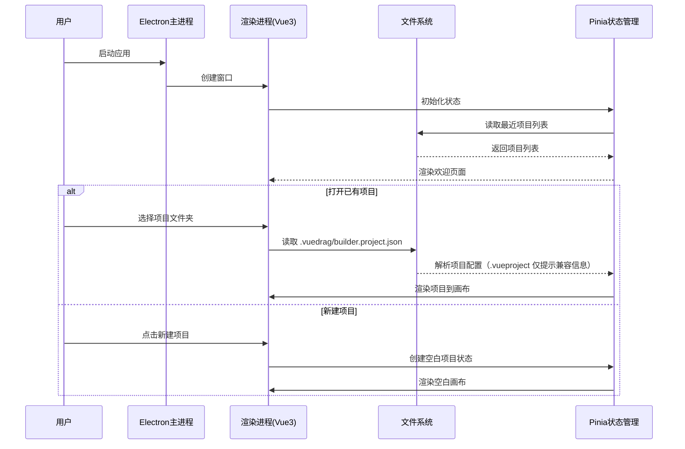
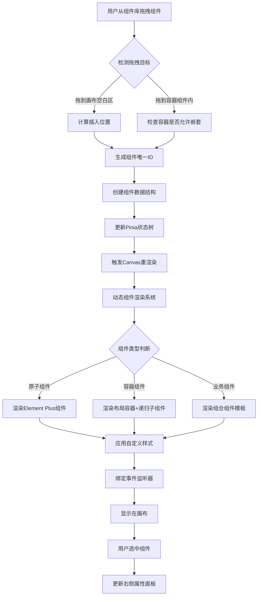
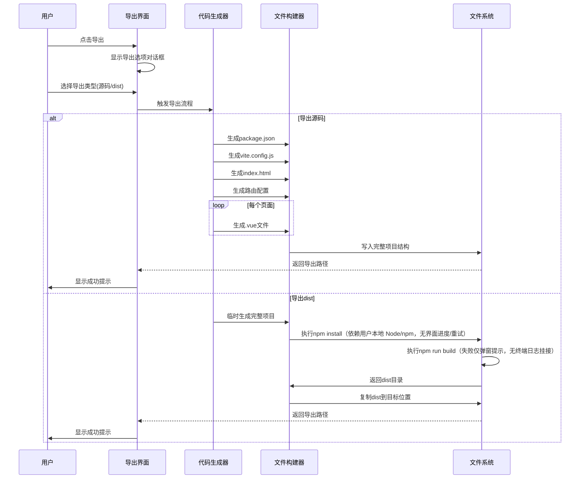
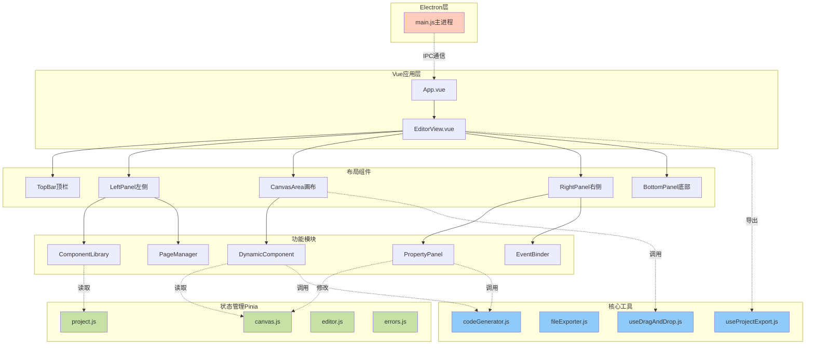
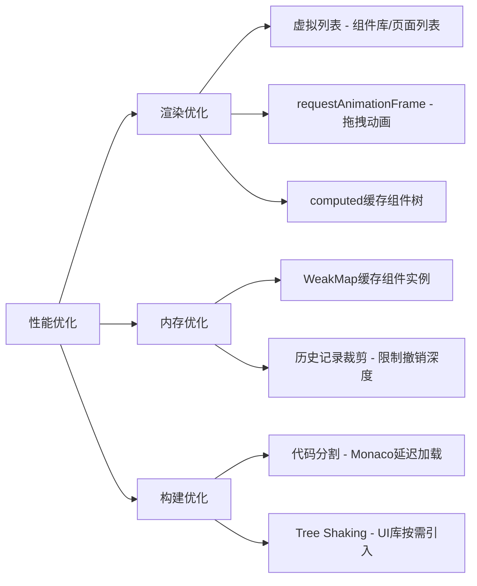
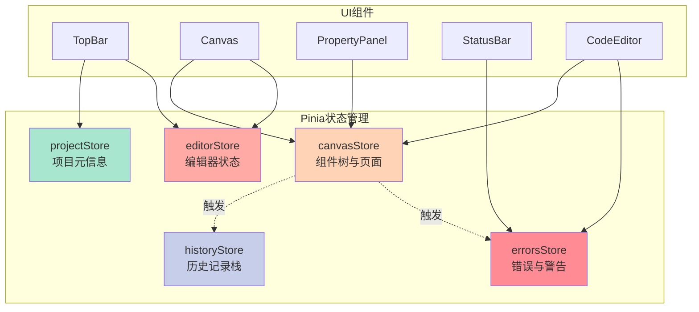

# V1.5.3 更新日志 (2025-12-06) — 导出构建修复

## 1. 问题描述
- 用户反馈导出的构建文件（dist）在打开 `index.html` 时页面显示空白。
- 经排查，主要原因有两点：
  1. **路径问题**：`vite.config.js` 缺少 `base: './'`，导致资源路径错误（已修复）。
  2. **路由模式问题**：生成的路由使用了 `createWebHistory`（History 模式）。在 `file://` 协议或非根目录部署下，History 模式无法正确解析路由，导致页面无法渲染组件（空白）。

## 2. 解决方案
- **路由模式调整**：将导出项目的路由模式从 `createWebHistory` 修改为 `createWebHashHistory`（Hash 模式）。
  - Hash 模式（URL 带 #）不依赖服务器配置，完美支持 `file://` 协议打开和任意子目录部署。
- **配置确认**：保留 `vite.config.js` 中的 `base: './'` 配置。

## 3. ASCII 原型（路由模式修正）
```text
+----------------+      +----------------------+      +---------------------+
|  User Action   | ---> |  useProjectExport.js | ---> |  fileExporter.js    |
| (Click Export) |      |  (Controller)        |      |  (Generator)        |
+----------------+      +----------------------+      +----------+----------+
                                                                 |
                                                                 v
                                                      +---------------------+
                                                      | generateRouter      |
                                                      |                     |
                                                      | [ ] createWebHistory|
                                                      | [x] createWebHashHistory
                                                      +----------+----------+
                                                                 |
                                                                 v
                                                      +---------------------+
                                                      |  src/router/index.js|
                                                      |  (Hash Mode)        |
                                                      +---------------------+
```

## 4. 技术架构与影响范围
- **核心修改文件**: `src/utils/fileExporter.js`
- **修改函数**: `generateRouter`
- **影响范围**:
  - 仅影响“导出源码”和“导出并构建”功能生成的项目路由配置。
  - 导出的项目 URL 将变为 `index.html#/` 格式。
  - 极大提高导出项目的兼容性（即点即用）。

## 5. 开发 Todo
1) 修改 `src/utils/fileExporter.js` 中的 `generateRouter` 函数。
2) 将 `createWebHistory` 替换为 `createWebHashHistory`。
3) 移除 `import.meta.env.BASE_URL` 参数（Hash 模式通常不需要）。

# V1.5.2 更新日志 (2025-12-06) — 插槽设计器优化（无侵入式布局）

## 1. 需求更新（插槽设计器体验优化）
- 1.1 全面支持插槽：为所有容器组件（Container, Flex, Grid）添加 `header`, `default`, `footer` 插槽支持。
- 1.2 无侵入式布局：重新设计插槽设计器，使其在非交互状态下不影响组件在画布中的显示高度。
  - 空插槽自动折叠：当插槽为空且未进行拖拽操作时，插槽区域高度为 0，不可见。
  - 智能展开：当拖拽组件经过容器时，自动展开所有插槽区域（显示虚线框与提示），便于放置。
  - 悬浮标题：插槽标题（如 #header）改为绝对定位的悬浮标签，不占据文档流空间，仅在拖拽或选中时显示。
- 1.3 视觉优化：插槽区域默认透明无边框，仅在激活（拖拽经过/选中）时显示虚线边框与背景高亮。

## 2. ASCII 原型（插槽交互状态）
```text
[常规状态 - 容器内有内容]          [拖拽状态 - 拖入新组件]
┌──────────────────────┐         ┌──────────────────────┐
│ Container            │         │ Container            │
│ ┌──────────────────┐ │         │ ┌────── #header ─────┐ <-- 自动展开
│ │ 现有内容 (default) │ │         │ │   (Drop Here)    │ │
│ └──────────────────┘ │         │ └────────────────────┘ │
└──────────────────────┘         │ ┌────── #default ────┐ │
(header/footer 折叠隐藏)          │ │ 现有内容           │ │
                                 │ └────────────────────┘ │
                                 │ ┌────── #footer ─────┐ <-- 自动展开
                                 │ │   (Drop Here)    │ │
                                 │ └────────────────────┘ │
                                 └──────────────────────┘
```

## 3. 技术架构与影响范围
- 组件注册表 (`componentRegistry.js`)：
  - 为 `Container`, `Flex`, `Grid` 组件添加 `slots: ['header', 'default', 'footer']` 配置。
- 画布渲染 (`DynamicComponent.vue`)：
  - 状态管理：利用 `isDragOverContainer` 状态控制插槽显示。
  - 渲染逻辑：新增 `shouldShowSlot` 计算属性，仅在“有内容”或“正在拖拽经过”时渲染插槽 DOM。
  - 样式重构：
    - `.slot-zone`: 默认 `height: auto` (由内容撑开), `padding: 0`, `border: transparent`。
    - `.slot-title`: `position: absolute`, `top: -10px`, `z-index: 10`，避免占据布局空间。
    - 交互类 `.drag-over`: 激活时恢复 padding 和 border，提供可视化反馈。
- 影响范围：
  - 仅影响容器类组件的画布渲染表现。
  - 不影响代码生成（生成逻辑已支持插槽）。
  - 不影响非容器组件。
  - 旧项目兼容：无缝兼容，旧容器默认使用 default 插槽，新插槽为空自动隐藏。

## 4. 开发 Todo
1) 更新注册表：为容器组件添加 slots 定义。
2) 改造渲染器：实现 `shouldShowSlot` 逻辑，实现空插槽折叠。
3) 样式优化：实现悬浮标题与拖拽时展开的 CSS 交互。
4) 回归测试：验证普通拖拽、插槽拖拽、嵌套容器的表现，确保无拖拽时高度正常。

# V1.5.1 更新日志 (2025-12-05) — 逻辑交互重构（更直观/无侵入）

## 1. 需求更新（逻辑组件可用性专项）
- 1.1 单入口 + 无拖拽成本：左侧「逻辑」标签页提供「添加逻辑」按钮与搜索列表；状态栏提供快捷“Logic”按钮；画布右上浮窗“添加逻辑”按钮（不挡操作）。拖入逻辑时不进组件树，直接跳转逻辑区创建实例。
- 1.2 逻辑工作区重排：改为双栏布局（左：逻辑列表；右：详情卡片+返回值预览+删除/重命名）。无需画布节点，创建即入列表，可单击选中查看详情。
- 1.3 绑定流程简化：右侧属性面板的「逻辑引用」支持搜索/筛选，一键创建逻辑并绑定（若无逻辑时提示“去创建”并跳转）。
- 1.4 安全与兼容：组件树、模板生成不变；未使用逻辑可安全删除，被引用逻辑删除需显式确认；未创建逻辑时 UI 仅展示入口，不影响其他模块。

## 2. ASCII 原型（关键区域）
```
左侧栏 (Logic Tab)           中部逻辑工作区 (列表+详情)                右侧属性面板（选中组件）
┌─────────────────┐    ┌────────────────────────────────┐    ┌────────────────────────────┐
│ 组件 | 页面 | 逻辑 │    │ 逻辑列表                    │    │ 属性                        │
│ ───────────────── │    │ [ + 添加逻辑 ] [ 搜索框 ]    │    │ 文本: "确认"                 │
│ useMouse   (@vueuse)│   │ - useMouse (绑定 2) [选中]   │    │ 类型: primary                │
│ useWindowSize      │   │ - useAsyncState (绑定 0)     │    │                              │
│ useAsyncState      │   └──────────────────────────────┘    │ 逻辑引用                     │
│ [添加逻辑]按钮      │    │ 详情 (选中 useMouse)          │    │ ▸ 绑定属性: x → [useMouse.x ▾] │
└─────────────────┘    │ 返回值: x, y                    │    │ ▸ 绑定属性: y → [useMouse.y ▾] │
                       │ 来源: @vueuse/core              │    │ [去创建逻辑] (无逻辑时)       │
画布右上浮窗 (不遮挡)   │ 操作: 重命名 | 删除             │    └────────────────────────────┘
┌─────────────┐        └────────────────────────────────┘
│ + 添加逻辑  │   底部状态栏: Logic [useMouse, useWindowSize] (点击=打开逻辑区)
└─────────────┘
```

## 3. 技术架构与影响范围（保持非相关模块不变）
- UI/交互：
  - 左侧逻辑标签：新增「添加逻辑」按钮与搜索列表；移除必须拖拽的路径，改为点击创建。
  - 逻辑工作区：列表+详情双栏；仅展示逻辑，不渲染组件；操作包含重命名、删除、返回值预览。
  - 属性面板：逻辑引用支持搜索与“去创建”快捷入口（跳转逻辑区并预选当前页）。
  - 画布与状态栏：仅新增快捷入口按钮，不改动组件树/渲染逻辑。
- Store/数据：复用页面级 `composables`，仅补充可选字段（如重命名时间戳/最后使用）默认值为空，旧数据无需迁移；组件 `logicBindings` 行为不变。
- 代码生成：保持现有逻辑导入/解构/绑定策略，不新增字段影响模板；未使用逻辑时输出不变。
- 兼容性：旧项目、未用逻辑的页面行为完全一致；逻辑删除保护依旧；无对其他模块（插槽/Teleport/Suspense/组件树）改动。

## 4. 开发 Todo（执行顺序）
1) 逻辑入口统一：左侧标签添加按钮+搜索；状态栏/画布浮窗入口；禁用“逻辑拖入组件树”。
2) 逻辑工作区重构：列表+详情双栏，支持选中、重命名、删除、返回值预览；空态引导。
3) 绑定体验优化：属性面板逻辑引用支持搜索/去创建，绑定后高亮；无逻辑时提供跳转提示。
4) 保护与校验：删除被引用逻辑需确认；未使用可直接删除；入口按钮不遮挡画布交互。
5) 回归验证：旧项目/无逻辑页面生成不变；逻辑创建/删除/绑定链路全程可用；生成代码可构建。

## 5. 验收与不影响性检查
- 无逻辑场景：UI 仅显示入口，不生成任何额外代码/数据。
- 生成保持：未绑定/未使用逻辑不产生 import/解构；绑定后输出与 1.5.0 方案一致。
- 非相关模块：插槽、Teleport、Suspense、组件树、样式、事件保持现状；未触碰代码模式、导出流程除依赖检查外不变。

# V1.5.0 更新日志 (2025-12-05) — 逻辑/插槽/Teleport&Suspense（VSCode 风格对齐）

## 1. 需求更新（确保 UI/交互保持 VSCode 风格，不影响既有模块）
- 1.1 组合式函数市场（Logic Board）：左侧新增「逻辑」标签页，进入独立「逻辑编排」视图；逻辑实例不进入组件树，主画布拖入逻辑时自动跳转逻辑编排。右侧属性面板新增「逻辑引用」下拉，允许把返回值绑定到选中组件属性/表达式。底部状态栏列出当前页逻辑实例（只读）。
- 1.2 插槽设计器：父组件声明 `slots` 后，画布为每个插槽渲染 DropZone（虚线 VSCode 边框）；拖入子组件记录 `slotName`。右侧属性面板可切换子组件 `slotName`（同父组件 slots 范围）。未声明 slots 的组件保持旧行为。
- 1.3 Teleport + Suspense 容器：组件库新增 `Teleport`、`Suspense`；Teleport 显示目标提示（to=body/#app/custom），Suspense 复用插槽 DropZone 呈现 `default`/`fallback`。生成模板兼容可视化与代码模式。
- 1.4 兼容与保护：旧项目/无 `composables`/无 `slotName` 数据保持现状；逻辑被绑定时禁止直接删除（提示先解绑或强删）；未使用逻辑可清理。

## 2. ASCII 原型（VSCode 布局基调）
```
左侧栏 (VSCode Tabs)        中部逻辑编排视图 (独立)               右侧属性面板 (选中 UI 组件)
┌────────────────┐    ┌─────────────────────────────────────┐   ┌──────────────────────────────┐
│ 组件 | 页面 | 逻辑 │    │ Page: Home  [Logic Board]          │   │ 属性                        │
│ ─────────────── │    │  [useMouse] ── outputs: x,y           │   │ 文本: "确认"                 │
│ 逻辑库           │    │  [useWindowSize] ── outputs: w,h      │   │ 类型: primary                │
│  ⚡ useMouse     │    │  [useAsyncState] ── outputs: state    │   │                              │
│  📐 useWindowSize│    │                                        │   │ 逻辑引用 (可绑定变量)        │
│  ⏳ useAsyncState│    │                                        │   │ x: [绑定 ▾]  y: [绑定 ▾]     │
└────────────────┘    └─────────────────────────────────────┘   │ w: [绑定 ▾]  h: [绑定 ▾]       │
                                                               │                              │
画布插槽可视化 (Card 示例)      Teleport 容器                 │ 插槽 Slot (选中子组件)       │
+--------------------------------------------------+  +----------------------------------+   │ 所属插槽: [header ▾]          │
| Card (selected)                                  |  | Teleport → body  (带目标提示)    |   │ (header/default/footer)      │
| [#header] ────── DropZone ──────                 |  |  [Modal 内容]                    |   └──────────────────────────────┘
|  Button: 添加   Button: 更多                     |  +----------------------------------+
| [#default] ──── DropZone ────                    |  Suspense 容器（插槽化）
|  文本: "正文"   图片: banner.png                  |  +----------------------------------+
| [#footer] ──── DropZone ────                     |  | Suspense                         |
|  Button: 确定   Button: 取消                     |  | [#default]  AsyncBlock          |
+--------------------------------------------------+  | [#fallback] Skeleton            |
状态栏: Logic 使用 (只读)  [useMouse, useWindowSize]
```

## 3. 技术架构与影响范围（避免影响非相关模块）
- Store：`canvas.js` 增加页面级 `composables` 数组与组件 `slotName` 字段；删除逻辑需校验引用；`editor.js` 记录逻辑面板状态与跳转入口。旧数据缺省值 = 向后兼容。
- 组件/视图：
  - 左侧面板新增「逻辑」标签与逻辑库列表；逻辑编排视图（可单页/Tab）不渲染 UI 组件树。
  - `DynamicComponent.vue` 渲染 slots DropZone，按 `slotName` 分桶；无 slots 时走原有 children 渲染。
  - 属性面板新增「逻辑引用」和「插槽切换」区块。
  - 状态栏追加逻辑列表只读展示。
- 注册表：`componentRegistry.js` 为可插槽组件补充 `slots` 元数据；新增 `Teleport`、`Suspense`，并记录 `package` 来源（如 `@vueuse/core` 对应依赖说明）。
- 代码生成：
  - Script：遍历 `page.composables` 生成唯一 import（按 name 去重）、实例解构按 id，避免重复导入。
  - Template：子组件按 `slotName` 分组输出 `<template #slot>`；Teleport/Suspense 生成合规结构；未声明 slots 维持旧输出。
- 依赖与导出：仅使用 VueUse 时写入 `@vueuse/core` 依赖；导出时检查缺失依赖提醒；其他模块无改动。

## 4. 开发 Todo（顺序执行，确保可回归）
1) 注册表与依赖：补充 `slots` 元数据；新增 Teleport/Suspense；标记 `package`；导出依赖检查。
2) Store 扩展：`canvas.js`/`editor.js` 增加 `composables`、`slotName`、引用校验；默认值回退保障旧项目。
3) 逻辑编排视图：左侧逻辑库 + Logic Board；主画布拖入逻辑跳转；状态栏显示只读逻辑清单；删除保护/清理未用逻辑。
4) 属性面板：新增「逻辑引用」绑定下拉；插槽子组件 `slotName` 选择；VSCode 风格分组。
5) 画布渲染：`DynamicComponent` 插槽 DropZone；Drag&Drop 写入 `slotName`；无 slots 保持现状。
6) 代码生成：Script 导入/解构去重；Template 按 `slotName` 生成 `<template #...>`；支持 Teleport/Suspense。
7) 验收回归：旧项目无 `composables/slotName` 生成结果不变；逻辑被绑定时删除提示；Teleport 目标提示与 Suspense fallback 可视渲染校验；导出依赖校验。

## 5. 验收与不影响性检查
- 兼容性：无 `composables` / 无 `slotName` / 未使用 Teleport/Suspense 时，画布与导出代码完全保持现状。
- 可视化优先：新增能力均可拖拽/下拉完成，无需手写代码。
- 保护：删除被引用逻辑时必须提示；未使用逻辑可安全清理；插槽切换不重建节点。
- 导出：使用 VueUse/Teleport/Suspense 时代码可直接构建，依赖声明完整。

# [Archived] V1.5.0 更新日志 (2025-12-05)

# V1.0.4 更新日志 (2025-12-04)

## 1. 需求更新

### 1.1 可视化背景修复 (Canvas Background Fix)
- **需求**: 修复可视化模式下背景高度受内部页面大小影响的问题，确保背景始终充满应用显示区域。
- **实现**: 强制 `.canvas-area` 占据 100% 宽高，并修正 CSS 布局。

### 1.2 代码预览缩放修复 (Preview Zoom Fix)
- **需求**: 修复代码模式下在预览页面内部按 `Ctrl + 滚轮` 无法触发缩放的问题。
- **实现现状**: 已在 iframe 内部注入 `wheel` 监听并通过 `postMessage` 转发，父窗口 `CodeEditor.handleIframeMessage` 再调用 `handleWheel` 实现缩放；当前仅处理 `Ctrl/Cmd + Wheel`，未接管普通垂直滚动（预览保持页面内滚动）。

### 1.3 代码预览触控板支持 (Preview Touchpad)
- **需求**: 为代码模式预览添加触控板支持（主要是水平平移）。
- **实现现状**: iframe 转发包含水平分量的 `wheel` 事件，父窗口仅对水平分量执行平移；垂直平移仍交由 iframe 内部默认滚动处理，尚未做全向平移接管。

### 1.4 折叠图标显示修复 (Collapse Icons Fix)
- **需求**: 修复资源管理器和属性检查器的折叠按钮图标不显示的问题。
- **原因**: `<component :is="...">` 使用字符串引用组件失败。
- **修复**: 直接绑定组件对象 (`:is="ArrowLeft"`).

## 2. 技术方案

### 2.1 背景布局
- **文件**: `src/components/canvas/CanvasArea.vue`
- **CSS**: `.canvas-area { width: 100%; height: 100%; }`

### 2.2 Iframe 事件穿透
- **文件**: `src/components/code-mode/CodeEditor.vue`
- **注入脚本**:
  ```javascript
  window.addEventListener('wheel', (e) => {
    if (e.ctrlKey || Math.abs(e.deltaX) > Math.abs(e.deltaY)) {
      e.preventDefault()
      window.parent.postMessage({ type: 'preview-wheel', ... }, '*')
    }
  }, { passive: false })
  ```
- **父窗口监听**: `window.addEventListener('message', handleIframeMessage)`

## 3. Todo List

1.  [x] 修改 `CanvasArea.vue`: 修复背景 CSS。
2.  [x] 修改 `CodeEditor.vue`: 注入 iframe 事件监听脚本。
3.  [x] 修改 `CodeEditor.vue`: 实现父窗口消息处理与缩放/平移逻辑。
4.  [x] 修改 `EditorView.vue`: 修复折叠图标绑定。

# V1.0.3 更新日志 (2025-12-04)

## 1. 需求更新

### 1.1 代码预览体验一致性 (Preview Consistency)
- **需求**: 代码模式下的预览背景应与可视化模式保持一致（深色背景+网格），以提供统一的视觉体验。
- **实现**: 同步 `CanvasArea` 的背景样式到 `CodeEditor` 的预览区域。

### 1.2 预览交互优化 (Interaction Fixes)
- **需求**: 解决代码模式预览中缩放/平移与内部滚动的冲突。
- **方案**: 
  - 移除无修饰键时的滚轮平移功能，恢复默认的页面滚动行为。
  - 保留 `Ctrl + Wheel` 进行缩放。
  - 保留 `Space + Drag` 进行平移。
- **实现现状**: `CodeEditor.handleWheel` 仅在 `ctrl/meta` 下做缩放；普通滚轮主要保留 iframe 内滚动，仅对水平分量执行平移（垂直滚动未被接管）。

### 1.3 视图重置 (Reset View)
- **需求**: 在可视化画布和代码预览中提供“重置视图”按钮，一键恢复居中和 100% 缩放。
- **交互**: 点击按钮 -> `panX=0, panY=0, zoom=100`.

### 1.4 折叠图标优化 (Collapse Icons)
- **需求**: 将侧边栏折叠按钮图标更改为更直观的方向箭头 (`<` 和 `>`)。

## 2. 技术方案

### 2.1 样式同步
- **文件**: `src/components/code-mode/CodeEditor.vue`
- **CSS**: 复制 `CanvasArea` 的 `.canvas-background` 样式到 `.preview-viewport`。

### 2.2 交互逻辑
- **文件**: `src/components/code-mode/CodeEditor.vue`
- **逻辑**: 修改 `handleWheel`，仅在 `e.ctrlKey` 为真时阻止默认行为并执行缩放。

### 2.3 重置功能
- **文件**: `src/components/canvas/CanvasArea.vue`, `src/components/code-mode/CodeEditor.vue`
- **实现**: 添加悬浮按钮 (Canvas) 和工具栏按钮 (Code)，绑定 `resetView` 方法。

## 3. Todo List

1.  [x] 修改 `CodeEditor.vue`: 更新预览背景样式。
2.  [x] 修改 `CodeEditor.vue`: 修复滚轮冲突。
3.  [x] 修改 `CodeEditor.vue`: 添加重置视图按钮。
4.  [x] 修改 `CanvasArea.vue`: 添加重置视图按钮。
5.  [x] 修改 `EditorView.vue`: 更新折叠图标为箭头。

# V1.0.2 更新日志 (2025-12-04)

## 1. 需求更新

### 1.1 触控板支持 (Touchpad Support)
- **需求**: 支持使用触控板双指滑动进行画布平移，无需按住空格键。
- **交互**: 双指在画布上滑动 -> 画布跟随平移。
- **技术**: 监听 `wheel` 事件，当无 Ctrl/Meta 键按下时，将 `deltaX/Y` 映射为平移量。

### 1.2 多端预览切换 (Device Preview)
- **需求**: 在顶部工具栏添加切换按钮，快速预览桌面、平板、手机尺寸。
- **交互**: 点击图标切换画布宽度。
- **尺寸定义**:
  - Desktop: 1280px (自适应)
  - Tablet: 768px
  - Mobile: 375px

### 1.3 代码同步优化 (Code Sync)
- **需求**: 修复代码模式修改无法同步回可视化模式的问题。
- **优化**: 增强 `syncToCanvas` 解析逻辑，支持 `v-model` 映射，修复子组件递归解析问题。

### 1.4 UI 细节优化
- **需求**: 为左右侧面板的折叠按钮添加直观的图标 (Expand/Fold)。

### 1.5 代码模式预览优化 (Code Mode Preview)
- **需求**: 代码模式下的预览窗口应具备与可视化模式相同的交互体验（平移、缩放、设备尺寸切换）。
- **交互**: 
  - 鼠标滚轮/触控板 -> 平移/缩放。
  - 顶部设备切换 -> 预览窗口宽度响应。
- **原型**:
  ```
  +--------------------------------------------------+
  |  Code Editor      |      Preview Panel           |
  |                   |  +-----------------------+   |
  |  <template>       |  |      [Mobile]         |   |
  |    <div>...       |  |    +-------------+    |   |
  |                   |  |    |   Iframe    |    |   |
  |                   |  |    |             |    |   |
  |                   |  |    +-------------+    |   |
  |                   |  +-----------------------+   |
  +--------------------------------------------------+
  ```

### 1.6 代码模式自动同步 (Auto Sync)
- **需求**: 离开代码模式（切换回可视化模式）时，自动将代码变更同步到画布，防止修改丢失。
- **逻辑**: 在组件卸载前 (`onBeforeUnmount`) 自动触发 `syncToCanvas`。

## 2. 技术方案

### 2.1 触控板平移
- **文件**: `src/components/canvas/CanvasArea.vue`
- **逻辑**:
  ```javascript
  const handleWheel = (e) => {
    if (e.ctrlKey || e.metaKey) {
      // Zoom logic
    } else {
      // Pan logic
      panX.value -= e.deltaX
      panY.value -= e.deltaY
    }
  }
  ```

### 2.2 设备切换
- **文件**: `src/components/layout/TopBar.vue`
- **UI**: 添加三个图标按钮，绑定 `editorStore.setDeviceMode`。

### 2.3 代码同步
- **文件**: `src/components/code-mode/CodeEditor.vue`
- **逻辑**: 更新 `parseNodeV2`，增加对 `v-model` 的处理，确保组件树构建正确。

### 2.4 代码预览增强
- **文件**: `src/components/code-mode/CodeEditor.vue`
- **架构**: 
  - 在 `preview-panel` 中引入 `transform-layer` 和 `device-wrapper` 结构。
  - 复用 `CanvasArea` 的平移/缩放逻辑 (panX, panY, zoom)。
  - 绑定 `editorStore.deviceMode` 控制宽度。

### 2.5 自动同步
- **文件**: `src/components/code-mode/CodeEditor.vue`
- **逻辑**:
  ```javascript
  onBeforeUnmount(async () => {
    await syncToCanvas(true) // silent mode
    // ... cleanup
  })
  ```

## 3. Todo List

1.  [x] 修改 `CanvasArea.vue`: 实现触控板平移。
2.  [x] 修改 `TopBar.vue`: 添加设备切换按钮。
3.  [x] 修改 `EditorView.vue`: 更新折叠按钮图标。
4.  [x] 修改 `CodeEditor.vue`: 修复代码同步逻辑。
5.  [x] 修改 `CodeEditor.vue`: 实现预览区域的平移、缩放、设备尺寸响应（已通过 transform-layer + deviceMode 宽度 + pan/zoom 完成）。
6.  [x] 修改 `CodeEditor.vue`: 添加 `onBeforeUnmount` 自动同步逻辑（已在 `onBeforeUnmount` 中调用 `syncToCanvas(true)`）。

# V1.0.1 更新日志 (2025-12-04)

## 1. 需求更新

### 1.1 画布交互优化 (Canvas Panning)
- **现状问题**: 按下空格键拖动画布时，如果鼠标移动过快超出画布区域，或者经过某些特定元素，拖动会中断或失效。
- **优化目标**: 实现全局平滑拖动。按下空格键并按下鼠标左键后，无论鼠标移动到屏幕何处，画布都应跟随移动，直到松开鼠标左键。
- **交互原型**:
  ```
  [ 按住 Space + 鼠标左键拖动 ]
       |
       v
  +----------------------------------+
  |           Canvas Area            |
  |                                  |
  |      [ Component ]               |
  |            ^                     |
  |            | (Mouse moves out)   |
  |            |                     |
  +------------|---------------------+
               |
        (Still Panning)
  ```

### 1.2 组件重排优化 (Component Reordering)
- **现状问题**: 从组件库拖入新组件正常，但拖动已放置在画布上的组件进行重新排列（排序或移动到其他容器）失效。
- **优化目标**: 
  - 选中画布上的组件并拖动时，应显示"移动"光标。
  - 拖动经过其他组件或容器时，应正确显示插入位置指示线。
  - 松开鼠标后，组件应移动到新位置。
- **交互原型**:
  ```
  [ Component A ]  [ Component B ]
         |
    (Drag A)
         |
         v
  [ Component B ]  | (Drop Indicator)
                   |
             [ Component A ] (Moved)
  ```

## 2. 技术方案

### 2.1 画布平移 (Canvas Panning)
- **文件**: `src/components/canvas/CanvasArea.vue`
- **方案**:
  - 在 `handleMouseDown` 中，当开始平移时，使用 `window.addEventListener` 绑定 `mousemove` 和 `mouseup` 事件。
  - 这确保了即使鼠标移出 `.canvas-area` DOM 元素，事件仍能被捕获。
  - 在 `handleMouseUp` (及 `mouseleave` 的清理逻辑中) 移除 `window` 上的监听器。
  - 移除模板中绑定在 `div` 上的 `@mousemove` 和 `@mouseup` (或保留作为 fallback，但主要逻辑移至 window handler)。

### 2.2 组件重排 (Component Reordering)
- **文件**: 
  - `src/components/canvas/CanvasArea.vue`
  - `src/components/canvas/DynamicComponent.vue`
- **方案**:
  - **识别移动操作**: 在 `dragover` 事件中，由于安全限制无法直接读取 `dataTransfer.getData`，改用 `e.dataTransfer.types.includes('move-component-id')` 来判断是否为组件移动操作。
  - **设置 DropEffect**: 
    - 如果检测到移动操作，显式设置 `e.dataTransfer.dropEffect = 'move'`。
    - 否则默认为 `'copy'` (用于从组件库添加)。
  - **DragStart 兼容性**: 在 `DynamicComponent.vue` 的 `handleDragStart` 中，设置 `e.dataTransfer.effectAllowed = 'all'` (或 `'copyMove'`)，以确保浏览器允许在不同 `dropEffect` 场景下的拖放。

## 3. Todo List

1.  [x] 修改 `src/components/canvas/CanvasArea.vue`: 实现基于 `window` 的画布平移事件监听。
2.  [x] 修改 `src/components/canvas/CanvasArea.vue`: 优化 `handleDragOver` 逻辑，使用 `types.includes` 检测移动操作。
3.  [x] 修改 `src/components/canvas/DynamicComponent.vue`: 优化 `handleDragStart` 设置 `effectAllowed`。
4.  [x] 修改 `src/components/canvas/DynamicComponent.vue`: 优化 `handleDragOver` 逻辑，使用 `types.includes` 检测移动操作并设置正确的 `dropEffect`。
5.  [ ] 验证画布平移功能（包括移出区域）。
6.  [ ] 验证组件重排功能（同级排序、跨容器移动）。

# VueDrag Builder PRD（产品需求文档）

## 一、产品概述

### 1.1 核心目标（Mission）
为前端小白打造零配置的 Vue3 可视化开发平台，让不熟悉 Vue 的初学者也能通过拖拽和简单配置，快速构建专业级的 Vue3 应用（原型 Demo、博客、展示页等），并一键导出为标准 Vite + Vue3 工程或构建产物。

### 1.2 产品定位
- 形态：Electron 桌面应用
- 技术栈：Electron + Vue3 + Vite + Pinia + Element Plus（或可选 UI 库）+ Monaco Editor
- 核心卖点：
  - 零配置开箱即用
  - 基于 Vue3 的强大组件库（原子组件 + 业务模板）
  - 支持拖拽式搭建 + 代码编辑双模式
  - 极简、专业兼具的 IDE 风格 UI

---

## 二、用户画像（Persona）

### 2.1 主要用户
**前端入门开发者 / 学生 / 设计师转前端**
- 掌握基础 HTML/CSS
- 对 Vue3、组件化开发、工程化（Vite、打包配置等）不熟悉
- 需要快速完成可视化页面：作品集、展示页、简单的业务 Demo

### 2.2 核心痛点
1. Vue/Vite 项目初始化与配置成本高，不知道从哪里开始。
2. 纯代码写 Vue 组件周期长，不利于快速验证想法。
3. 响应式布局（Flex/Grid）细节、兼容性、样式调整繁琐。
4. 需要可直接导出的标准 Vue3 项目结构，以便后续手写扩展。
5. 希望在可视化搭建的同时学习 Vue3 的代码结构和最佳实践。

---

## 三、产品版本规划

### 3.1 V1：最小可行产品（MVP）

> 布局采用：**方案 C 的 IDE 风格布局 + 方案 A 的快速原型设计理念**，底部状态栏/终端面板采用 VSCode 风格。

#### 3.1.1 MVP 核心功能

1. **项目管理系统**
  - 新建/打开/保存项目（目录模式，配置写入 `.vuedrag/builder.project.json`；旧 `.vueproject` 仅兼容读取提示，不再写出）。
  - 选择本地文件夹作为项目根目录（参考 VSCode 选择工作区行为）。
   - 自动保存机制：编辑器失焦时触发保存。（当前实现：基于 Pinia `isDirty` + 防抖保存；无 Hot Exit 草稿恢复。）
   - 最近项目列表：记录最近打开的项目（如 5 个）。
   - 项目级配置：
     - UI 库选择（如：Element Plus / Naive UI / 自定义简单模板）。
        - 当前版本仅在项目元数据中存储选择，运行态始终使用 Element Plus。
      - npm 镜像源配置（默认使用淘宝镜像，支持用户自定义镜像地址）。
   - 自动保存机制：
     - 编辑器失焦时触发保存，防抖延迟 500ms。
     - 未做语法校验拦截；无草稿恢复/Hot Exit，应用崩溃后无法自动恢复未保存内容。

2. **主界面布局（IDE 风格 + 极简原型理念）**
   - 顶部菜单栏/工具栏：
     - 应用标题：`VueDrag Builder`
     - 按钮：撤销、重做、保存、预览、导出、切换模式（可视化 / 代码）、项目设置。
   - 三栏布局：
     - 左侧：组件库 + 页面管理（类似 Photoshop 图层管理）。
     - 中间：画布区域（实时预览，所见即所得）。
     - 右侧：属性面板（样式、布局、事件、数据相关配置）。
   - 底部：状态栏 + 终端面板（仿 VSCode 风格）：
     - 状态栏：显示项目信息、错误/警告数量、当前模式、保存状态等。
     - 终端面板：Tab 切换（终端、问题、输出），默认折叠，点击状态栏错误提示可展开。
     - 当前仅展示固定占位文本，未自动挂接构建/语法/运行时日志。

3. **页面与路由管理（多页面支持，MVP 必须）**
   - 页面列表（左侧面板的一个标签页）：
     - 展示页面集合，如：`首页`、`关于我们` 等。
     - 每个页面有唯一 ID（如：`page_001`）与路由路径（如：`/`, `/about`）。
     - 支持新增、删除、重命名页面。
     - 支持页面排序（决定路由与导航顺序）。
   - 页面跳转逻辑：
     - 通过组件（如按钮）绑定跳转事件，根据页面 ID/路由进行跳转。
     - 支持路由传参（如：query 参数、路径参数），在事件配置中可设置传递的数据。（当前实现仅提供目标页面选择，未提供参数配置 UI 或运行时路由切换，运行态始终停留在 `/editor`；路由生成仅在导出时使用。）
    - 自动生成 Vue Router 配置（导出项目时使用，编辑器内未动态挂载）。

4. **组件拖拽与布局系统（基于 Flexbox / Grid 的约束布局）**
   - 左侧组件库面板：
     - 分类展示组件（容器类、基础类、表单类、业务模块等）。
   - 拖拽交互：
     - 用户可从左侧组件列表拖拽到中间画布区域。
     - 组件可拖入容器组件内部（支持嵌套）。
     - 显示插入位置高亮（蓝色插入线提示，精确指示插入点）。
    - Grid 精确选择目标行列的交互未实现，当前仅按上下顺序插入。
   - 布局特性：
     - 支持 Flex 布局容器：水平/垂直方向、对齐方式、间距等。
     - 支持 Grid 布局容器：列数、行高、间距、对齐方式。
     - 基于约束布局（而非完全自由绝对定位），后续版本可扩展自由布局。
     - 子组件数量无限制（依赖浏览器性能，大量组件时自动优化渲染）。
   - 尺寸调整：
    - 规划项；当前界面未提供可视化尺寸拖拽（需在样式面板手动输入宽高）。
   - 组件操作：
     - 选中、删除、复制、粘贴。
     - 键盘快捷键支持（如 Delete 删除，Ctrl+Z 撤销，Ctrl+Y 重做）。

5. **组件库（当前实现与规划）**

  **当前已提供的原子/容器组件：**
  - Button, Link
  - Text / Heading
  - Input / Textarea
  - Image, Divider
  - Icon, Video
  - Checkbox / Radio / Select / Switch / DatePicker
  - Container / Flex / Grid / Card（容器类）

  **尚未实现的业务模块（规划项，当前代码库未提供）：**
  - 登录表单（用户名 + 密码 + 登录按钮）
  - 数据列表 / Table（分页/示意）
  - 其他复合组件模板

  **实现说明**: 组件注册表由 `src/utils/componentRegistry.js` 提供；当前版本未包含表格、登录表单等复合组件，需后续版本补充。

6. **可视化模式 - 属性/样式/事件面板（当前实现）**

   - 选中组件后，右侧显示对应的配置项；未选中时显示画布尺寸/背景设置。

   **属性面板（当前能力）：**
   - 动态遍历组件现有 props，提供文本/多行/数字/开关输入；无预置验证规则和占位逻辑。
   - 未实现 Hover/Loading/Disabled 等交互态快捷开关。

   **样式面板（当前能力）：**
   - 尺寸：宽度、高度、padding、margin。
   - 外观：圆角、边框、阴影、背景色、文字色、字体大小、字重、对齐。
   - 布局：display 切换（block/flex/grid/inline-block），基本 flex/grid 属性（方向、wrap、对齐、gap；grid 模式下列/行定义与 gap）。
   - 未支持：独立方向的 margin/padding 编辑、可视化对齐/栅格拖拽、显示/隐藏切换。

   **事件面板（当前能力）：**
   - 事件类型选项：click/hover/focus。
   - 预设动作：页面跳转（按页面 id）、打开弹窗（文本占位）、显示/隐藏组件（目标组件选择）、运行脚本（文本占位）。
   - 未实现：表单校验规则、条件表达式执行、路由参数/查询配置、复杂动作链、内置校验库绑定。

7. **代码模式（当前实现，单 Monaco 视图 + 预览）**

   - 模式切换：顶部工具栏“可视化 / 代码”按钮。
   - 布局：左/右双栏，左为单 Monaco 编辑器（一个文件，顶部 Tab 仅用于跳转到 template/script/style 片段），右为内嵌 iframe 预览。
   - 编辑器：使用 Monaco Editor，提供语法高亮与基础格式化，未集成静态检查/错误面板提示。
   - 双向同步机制（当前能力）：
     - **可视化 → 代码**：基于 `generateVueSFC` 生成完整 SFC（template/script/style）并写入 Monaco；画布变更会触发更新。
     - **代码 → 可视化**：`syncToCanvas` 使用 `DOMParser` 只解析 template 基本结构，映射到 Container/Flex/Grid/Card/Button 等组件；不解析 `<script>`/指令/v-if/v-for/slot，也无 AST 级恢复，复杂逻辑不会回填组件树。
   - 限制：
     - 代码语法错误不会阻止模式切换，也未在问题面板标记。
     - 无“锁定区域”或“孤儿代码”提示，未实现 AST 解析、指令/插槽解析、事件/props 的完整反向映射。

8. **实时预览与热重载（当前实现）**
   - 可视化模式：组件属性/样式修改即时渲染于画布。
   - 代码模式：Monaco 内容变更即时更新预览（未做防抖），预览依赖生成的 SFC；若脚本抛错，会在 iframe 内展示错误文本，无专门恢复按钮。

9. **导出功能（当前实现）**
   - 源码导出：`useProjectExport` 调用 `exportProject` 生成 Vite + Vue3 工程文件（package.json / vite.config / index.html / src/main.js / src/App.vue / src/router/index.js / 每个页面的 .vue），通过 Electron 写入目标目录并弹窗提示成功。
   - 构建导出：`exportAndBuild`/`exportBuildZip` 定义在 `fileExporter.js`，依赖 Electron 运行 npm 安装/构建；当前界面仅暴露“导出构建版本/ZIP”入口，无镜像切换 UI、无分阶段进度条，是否成功取决于主进程实现与用户本地 Node/npm 可用性。
   - 未实现项：内嵌 Node 环境、镜像源切换与重试按钮、后台构建进度展示、`.build-temp/` 保留、依赖完整性预检查、终端日志自动挂接。

10. **底部状态栏与终端（当前实现）**
    - 状态栏：显示分支标记“main*”、错误/警告计数、光标行列、编码、语言、通知图标；未显示项目名、页面、模式、Node 版本或镜像源。
    - 终端面板：含“终端/问题/输出”Tab，支持拖动高度与最大化；“问题”数据来源于 `errorsStore`（需业务侧写入），未自动收集语法错误；终端与输出依赖 Electron 提供的事件，当前 UI 未默认折叠逻辑，也未自动因错误/导出展开。

---

### 3.2 V2 及以后版本（Future Releases）

> 以下为未来规划功能，不属于 MVP 实现范围，但需要在架构设计中预留扩展点。

1. **V2.0 - 数据与 API 集成**
   - Mock 数据管理（内置 JSON 编辑器）。
   - API 接口配置（RESTful，支持 GET/POST 等）。
   - 组件级数据绑定（表格、列表、图表等组件绑定数据源）。
   - Axios 自动注入与统一请求封装。
   - 状态管理增强：引入 Pinia store 模块化管理业务数据。

2. **V2.5 - 自由布局与高级样式**
   - 支持绝对定位与自由布局模式（类似设计工具）。
   - 响应式断点管理（不同屏幕尺寸下使用不同布局/样式）。
   - CSS 动画配置可视化（过渡、关键帧）。
   - 主题系统：一键切换主题，支持主题导出。

3. **V3.0 - 协作与生态**
   - 自定义组件导入（本地/NPM 包中组件）。
   - 组件市场（社区共享组件库）。
   - Git 版本控制集成（提交、回滚、分支信息展示）。
   - 在线协同编辑（多用户实时协作）。

4. **V3.5 - 智能化辅助**
   - AI 文本生成页面结构（自然语言 → 组件树）。
   - 设计稿识别（Figma/Sketch 导入，半自动生成页面）。
   - 智能布局建议（推荐合理布局与组件组合）。

---

## 四、关键业务逻辑（Business Rules）

### 4.1 项目结构与配置文件

- 当前版本使用 `.vuedrag/builder.project.json` 存储工程元数据（metaVersion 2），在打开/保存时由 Electron 读写；旧版 `.vueproject` 文件仅兼容读取提示，不再作为主格式。
- 配置示例（简化）：

```json
{
  "metaVersion": 2,
  "projectName": "我的项目",
  "uiLibrary": "element-plus",
  "npmRegistry": "https://registry.npmmirror.com",
  "autoSave": true,
  "autoSaveInterval": 500,
  "lastSaved": "2025-12-03T10:30:00Z",
  "pages": [
    {
      "id": "page_001",
      "name": "首页",
      "route": "/",
      "componentTree": [
        {
          "id": "comp_001",
          "type": "Container",
          "parentId": null,
          "props": {},
          "styles": {},
          "events": [],
          "children": ["comp_002"]
        },
        {
          "id": "comp_002",
          "type": "Button",
          "parentId": "comp_001",
          "props": { "label": "点击我" },
          "styles": { "width": "120px" },
          "events": [],
          "children": []
        }
      ],
      "rootOrder": ["comp_001"]
    }
  ],
  "globalStyles": "",
  "customRegistry": ""
}
```

### 4.2 组件数据结构

统一的组件数据结构（在状态树中）：

```js
{
  id: "component_uuid",
  type: "Button",          // 组件类型（在组件注册表中有定义）
  parentId: "parent_uuid", // 父组件 ID，根节点为 null
  props: {                  // 与 Vue 组件绑定的 props
    label: "点击我",
    type: "primary"
  },
  styles: {                 // 内联样式或 class 生成依据
    width: "120px",
    backgroundColor: "#409EFF"
  },
  events: [                 // 事件绑定
    click: {
      action: "navigateTo",
      params: { path: "/about" }
    },
    focus: {
      action: "customCode",
      params: { code: "console.log('focused')" }
    }
  },
  children: ["child_1", "child_2"], // 子组件 ID 列表
  locked: false  // 是否为代码模式专属（锁定状态）
}
```

### 4.2.1 组件注册表数据结构

每个组件在 `componentRegistry.js` 中的定义示例：

```js
export const componentRegistry = {
  Button: {
    // 基础信息
    name: 'Button',
    displayName: '按钮',
    category: '基础组件',
    icon: 'button.svg',
    
    // 默认配置
    defaultProps: {
      label: '按钮',
      type: 'primary',
      size: 'medium'
    },
    
    // 属性配置面板
    propertySchema: {
      label: {
        type: 'string',
        label: '按钮文字',
        control: 'input'
      },
      type: {
        type: 'string',
        label: '按钮类型',
        control: 'select',
        options: ['primary', 'success', 'warning', 'danger', 'info', 'text']
      },
      disabled: {
        type: 'boolean',
        label: '禁用状态',
        control: 'switch'
      }
    },
    
    // 样式配置面板
    styleSchema: {
      width: { type: 'size', label: '宽度', control: 'input' },
      backgroundColor: { type: 'color', label: '背景色', control: 'colorPicker' }
    },
    
    // 支持的事件
    events: ['click', 'hover', 'focus'],
    
    // 是否允许有子组件
    canHaveChildren: false,
    
    // 可以放入哪些容器
    allowedParents: ['Container', 'Flex', 'Grid'],
    
    // 对应的 Element Plus 组件
    component: 'ElButton'
  },
  
  // 容器组件示例
  Container: {
    name: 'Container',
    displayName: '容器',
    category: '容器组件',
    canHaveChildren: true,
    allowedChildren: '*',  // 接受所有组件
    defaultProps: {},
    propertySchema: {},
    styleSchema: {
      padding: { type: 'spacing', label: '内边距', control: 'spacing' },
      backgroundColor: { type: 'color', label: '背景色', control: 'colorPicker' }
    },
    events: [],
    component: 'div'
  }
}
```

### 4.3 双向同步业务规则（当前能力）

1. **可视化 → 代码**
   - 由 `codeGenerator.generateVueSFC` 基于组件树生成 `<template>/<script setup>/<style scoped>`，写入 Monaco 并用于预览。
   - 生成的 `<script setup>` 仅包含 import/响应式数据/事件占位，未覆盖表单校验或复杂逻辑。

2. **代码 → 可视化**
   - `syncToCanvas` 仅解析 `<template>` DOM，映射基本标签到 Container/Flex/Grid/Card/Button/Text/Image 等组件，填充 props/styles；不解析 `<script>`、指令（v-if/v-for/v-show）、插槽、事件/动态表达式。
   - 复杂或未识别的结构不会同步到组件树，也无锁定标记；用户需在代码模式中自行维护。

3. **模式切换规则**
   - 切换到代码模式始终允许；切回可视化时不会因语法错误阻断。
   - 未实现错误收集/问题面板联动/锁定提示；切换不会提示高级代码丢失。

4. **冲突与错误处理**
   - 未实现“孤儿代码”检测或自动清理。
   - 语法错误提示仅依赖 Monaco 内置高亮（如有），状态栏/问题面板不自动展示错误计数。

### 4.4 布局与嵌套规则

- 布局基于 Flex / Grid 容器：
  - Flex 容器：
    - 允许任意数量子组件（无限制）。
    - 支持方向（row/column）、对齐方式、space-between 等。
  - Grid 容器：
    - 支持设置列数、列宽、行高、gap 等。
    - 规划中的“格子高亮 + 坐标提示”未上线，当前仅按上下顺序插入。
- 嵌套规则：
  - 容器组件可作为其他容器或普通组件的子组件。
  - 不限制嵌套深度（依赖浏览器性能，深层嵌套时自动优化渲染）。
- 拖拽对齐规则：
  - 拖拽过程中显示蓝色插入线，精确指示组件将被插入的位置。
  - 插入线位置基于鼠标最接近的子组件边缘（上/下或左/右，取决于布局方向）。
  - 目前仅支持线性插入（上/下），Grid 网格高亮与格子标记未实现。

### 4.5 导出规则

- 导出工程结构（已实现）：
  - `package.json` 写入 Vue3/Vite/Element Plus（或选定 UI 库占位）依赖。
  - `vite.config.js`：基础 Vite 配置。
  - `src/`：`main.js`、`App.vue`、`router/index.js`（按页面配置生成路由）、`pages/*.vue`（每页）、可选 `components/`。
  - `public/`：静态资源目录。

- 导出 dist（构建产物，当前实现有限）：
  - `exportAndBuild`/`exportBuildZip` 定义在 `fileExporter.js`，需 Electron 主进程支持 npm 安装+构建；是否成功取决于用户本地 Node/npm，界面无进度条/重试/镜像切换 UI。
  - npm 镜像切换仅在项目设置中写入 meta，未在构建流程展示实时日志；终端面板未自动挂接安装/构建日志。
  - 未集成内嵌 Node 或离线依赖缓存；构建失败仅通过弹窗提示，日志需自行查看主进程输出。
      - 📦 解析依赖（10%）
      - ⬇️ 下载依赖（10% - 60%）
      - 🔨 执行构建（60% - 90%）
      - ✅ 完成导出（90% - 100%）
    - 允许用户在构建时继续编辑项目（构建在后台 Worker 线程进行）。
    - 构建失败时：
      - 保留临时文件到项目目录的 `.build-temp/` 文件夹。
      - 显示详细错误日志，指出失败原因（如缺少依赖、语法错误）。
      - 提供"打开临时目录"按钮，供用户手动排查或修复。
  - 成功后将 `dist/` 文件夹复制到用户指定路径，并提示："构建成功！dist 文件夹已保存到 [路径]"。

---

## 五、数据契约（Data Contract）

### 5.1 输入数据

1. **用户操作数据**
   - 拖拽信息（起点组件类型、目标区域、索引等）。
   - 属性修改（组件 props、styles、events）。
   - 代码编辑（Template/Script/Style 文本内容）。

2. **项目配置数据**
   - 项目名称、UI 库选择。
   - 页面列表与页面路由配置。
   - 全局样式和依赖信息。

### 5.2 输出数据

1. **本地项目文件**
  - `.vuedrag/builder.project.json`（项目元数据，包含页面/组件树/样式）。
  - 项目目录本身即工作区，无单独缓存/临时构建文件描述。

2. **导出产物**
   - 标准 Vite + Vue3 源码工程目录。
  - 可直接部署的 `dist/` 目录（依赖本地 Node/npm 构建，成功与否取决于主进程实现与环境）。

### 5.3 内部数据流（高层视角）

```text
用户操作 → 组件树状态（Pinia） → 画布渲染（CanvasArea）
                        ↓
                      代码生成器（codeGenerator） → 代码编辑器显示（Monaco）
                        ↑
                    Template DOM 解析（受限） ← 代码模式编辑内容
```

---

## 六、MVP 界面原型（选定方案）

> 采用 **C 的 IDE 布局 + A 的快速原型理念**，终端默认折叠。

### 6.1 主编辑器界面 ASCII 原型

```text
╔════════════════════════════════════════════════════════════════════════════════════════╗
║ 文件 编辑 视图 工具 帮助                                          VueDrag Builder v1.0  ║
╠════════════════════════════════════════════════════════════════════════════════════════╣
║ ⟲  ⟳  💾  👁️  📤  |  [🖼️ 可视化]  [</>代码]  |  🖥️  📱  📱  |  100% ▼              ║
╠═══════╦════════════════════════════════════════════════════════════════╦══════════════╣
║       ║                                                                ║              ║
║ 资源  ║                       画布 - 首页.vue                           ║   检查器     ║
║       ║ ┌────────────────────────────────────────────────────────────┐ ║              ║
║ ▼ 组件║ │                                                            │ ║ ▼ 属性       ║
║ 搜索: ║ │     ┏━━━━━━━━━━━━━━━━━━━━━━━━━━━━━━━━━━┓                │ ║              ║
║ [....]║ │     ┃  Header 导航栏                   ┃                │ ║ ID:          ║
║       ║ │     ┗━━━━━━━━━━━━━━━━━━━━━━━━━━━━━━━━━━┛                │ ║ btn_001      ║
║ 容器  ║ │                                                            │ ║              ║
║ ├─Box ║ │     ┌──────────────────────────────────┐                │ ║ Label:       ║
║ ├─Flex║ │     │  欢迎使用 VueDrag Builder         │                │ ║ [登录____]   ║
║ └─Grid║ │     │                                  │                │ ║              ║
║       ║ │     │  ┌────────┐  ┌────────┐         │                │ ║ ▼ 布局       ║
║ 基础  ║ │     │  │ 按钮1   │  │ 按钮2   │         │                │ ║              ║
║ ├─Text║ │     │  └────────┘  └────────┘         │                │ ║ Display:     ║
║ ├─Btn ║ │     │                                  │                │ ║ [inline-flex]║
║ ├─Img ║ │     └──────────────────────────────────┘                │ ║              ║
║ ├─Link║ │                                                            │ ║ Margin:      ║
║ └─... ║ │                                                            │ ║ ┌─┬─┬─┬─┐   ║
║       ║ │     ┏━━━━━━━━━━━━━━━━━━━━━━━━━━━━━━━━━━┓                │ ║ │8│0│8│0│   ║
║ 表单  ║ │     ┃  Footer 页脚                     ┃                │ ║ └─┴─┴─┴─┘   ║
║ ├─Inp ║ │     ┗━━━━━━━━━━━━━━━━━━━━━━━━━━━━━━━━━━┛                │ ║              ║
║ ├─Sel ║ │                                                            │ ║ ▼ 样式       ║
║ └─... ║ │                                                            │ ║              ║
║       ║ └────────────────────────────────────────────────────────────┘ ║ Background:  ║
║ 业务  ║                                                                ║ [#409EFF] 🎨 ║
║ ├─登录 ║  <div class="flex-container">                                 ║              ║
║ └─表格 ║    <button class="primary">按钮1</button>                     ║ Border:      ║
║       ║  </div>                                                        ║ [1]px solid  ║
║ ▼ 页面║                                                                ║ [#ddd___] 🎨 ║
║       ║                                                                ║              ║
║ 🏠首页 ║                                                                ║ ▼ 事件       ║
║ 📄关于 ║                                                                ║              ║
║ + 新建║                                                                ║ @click       ║
║       ║                                                                ║ [添加动作▼]  ║
╠═══════╩════════════════════════════════════════════════════════════════╩══════════════╣
║ 📟 终端  ✓ 问题 (0)  ⚠️ 警告 (0)  ℹ️ 输出                                [—] [□] [×]  ║
║ (默认折叠，仅在需要时展开)                                                          ║
╚════════════════════════════════════════════════════════════════════════════════════════╝
```

该原型体现：
- 类 VSCode 的整体布局与交互心智模型。
- 左侧为“资源”视图（组件库 + 页面）。
- 中间为主画布区域，支持所见即所得。
- 右侧为检查器（属性、样式、事件）。
- 底部为终端与问题列表，但默认折叠以保持专注。

---

## 七、架构设计蓝图

### 7.1 核心流程图

#### 7.1.1 应用启动与项目加载流程（sequenceDiagram）



#### 7.1.2 组件拖拽与渲染流程（flowchart）



#### 7.1.3 双向同步机制（flowchart）

```mermaid
flowchart LR
    subgraph 可视化模式
        A[组件树状态] --> B[代码生成器]
        B --> C[生成Vue SFC代码]
    end
    
    subgraph 代码模式
      D[Monaco编辑器] --> E[代码内容]
      E --> F[Template DOM 解析 (有限)]
      F --> G{是否可解析?}
    end
    
    C --> H[同步到Monaco编辑器]
    
    G -->|简单结构| I[反向生成组件树]
    G -->|复杂/不识别| J[忽略，需手动维护]
    
    I --> A
    J --> A
    
    style A fill:#a8e6cf
    style E fill:#ffd3b6
    style H stroke:#ff6b6b,stroke-width:2px
```

#### 7.1.4 导出流程（sequenceDiagram）



---

### 7.2 组件交互与模块关系

#### 7.2.1 目录结构规划

```text
vue-drag-builder/
├── electron/                    # Electron主进程
│   ├── main.js                  # 入口文件
│   ├── preload.js               # 预加载脚本
│   └── menu.js                  # 菜单配置
│
├── src/                         # Vue3渲染进程
│   ├── main.js                  # Vue应用入口
│   ├── App.vue                  # 根组件
│   │
│   ├── views/                   # 页面视图
│   │   ├── WelcomeView.vue      # 欢迎页（选择/新建项目）
│   │   └── EditorView.vue       # 主编辑器视图
│   │
│   ├── components/              # 核心组件
│   │   ├── layout/              # 布局相关
│   │   │   ├── TopBar.vue       # 顶部菜单栏
│   │   │   ├── Toolbar.vue      # 工具栏（撤销/重做等）
│   │   │   ├── LeftPanel.vue    # 左侧面板容器
│   │   │   ├── RightPanel.vue   # 右侧检查器面板
│   │   │   ├── StatusBar.vue    # 底部状态栏（VSCode 风格）
│   │   │   └── BottomPanel.vue  # 底部终端/问题/输出面板（可折叠）
│   │   │
│   │   ├── left-panel/
│   │   │   ├── ComponentLibrary.vue  # 组件库标签页
│   │   │   ├── ComponentItem.vue     # 可拖拽的组件项
│   │   │   └── PageManager.vue       # 页面管理标签页
│   │   │
│   │   ├── canvas/
│   │   │   ├── CanvasArea.vue        # 画布主区域
│   │   │   ├── DynamicComponent.vue  # 动态组件渲染器
│   │   │   ├── SelectionBox.vue      # 选中框高亮
│   │   │   └── DropZone.vue          # 拖拽目标区域
│   │   │
│   │   ├── right-panel/
│   │   │   ├── PropertyPanel.vue     # 属性配置面板
│   │   │   ├── StyleEditor.vue       # 样式编辑器
│   │   │   ├── EventBinder.vue       # 事件绑定器
│   │   │   └── QuickStylePreset.vue  # 快捷样式预设
│   │   │
│   │   └── code-mode/
│   │       ├── CodeEditor.vue        # 代码编辑模式（全屏）
│   │       ├── MonacoEditor.vue      # Monaco编辑器封装
│   │       └── PreviewPanel.vue      # 代码模式预览区
│   │
│   ├── composables/                  # 组合式函数
│   │   ├── useDragAndDrop.js         # 拖拽逻辑
│   │   ├── useComponentTree.js       # 组件树操作
│   │   ├── useCodeSync.js            # 双向同步逻辑
│   │   ├── useHistory.js             # 撤销/重做
│   │   └── useAutoSave.js            # 自动保存（防抖500ms + 草稿恢复）
│   │                                 # 当前仅基于 isDirty 防抖保存，无草稿恢复/Hot Exit
│   │
│   ├── stores/                       # Pinia状态管理
│   │   ├── project.js                # 项目全局状态（含 npm 镜像配置）
│   │   ├── canvas.js                 # 画布状态（组件树）
│   │   ├── editor.js                 # 编辑器状态（选中、模式）
│   │   ├── history.js                # 历史记录栈
│   │   └── errors.js                 # 错误/警告状态（供状态栏和问题面板使用）
│   │
│   ├── utils/                        # 工具函数
│   │   ├── codeGenerator.js          # Vue代码生成器
│   │   ├── astParser.js              # AST解析器（支持 v-if/v-for/slot）
│   │   ├── fileExporter.js           # 文件导出器（源码 + dist）
│   │   ├── componentRegistry.js      # 组件注册表
│   │   ├── validation.js             # 表单校验库（完整校验规则）
│   │   └── nodeRunner.js             # 内嵌 Node.js 执行器（npm install/build）
│   │
│   └── config/
│       ├── components.json           # 组件库配置
│       └── templates.json            # 业务组件模板
│
├── public/
│   └── component-icons/             # 组件图标资源
│
└── package.json
```

#### 7.2.2 模块依赖关系图（Mermaid）



#### 7.2.3 关键文件职责说明

| 文件 | 职责 | 影响范围 |
|------|------|----------|
| `electron/main.js` | Electron 主进程入口，窗口创建、菜单、IPC 通信、文件系统访问 | 项目打开/保存、导出、应用生命周期 |
| `src/views/EditorView.vue` | 主编辑器视图，组织整体布局（左/中/右/底四大区域） | 所有编辑相关交互入口 |
| `src/components/layout/TopBar.vue` | 顶部菜单栏、模式切换、保存、预览、导出入口 | 全局操作入口 |
| `src/components/layout/StatusBar.vue` | 底部状态栏，显示错误/警告数量、保存状态、镜像源等 | 全局状态展示 |
| `src/components/layout/BottomPanel.vue` | 底部终端/问题/输出面板，可折叠 | 错误提示、构建日志 |
| `src/components/layout/LeftPanel.vue` | 左侧面板容器，承载组件库和页面管理 | 组件拖拽起点、页面选中 |
| `src/components/canvas/CanvasArea.vue` | 画布主区域，负责接收拖拽、展示组件树 | 可视化所见即所得核心 |
| `src/components/canvas/DynamicComponent.vue` | 递归渲染组件树为实际 Vue 组件 | 所有组件渲染逻辑核心 |
| `src/components/right-panel/PropertyPanel.vue` | 右侧属性面板，根据选中组件展示可编辑项 | 样式、布局、事件编辑入口 |
| `src/components/code-mode/CodeEditor.vue` | 代码模式主界面（Template/Style/Script + 预览） | 双向同步与代码编辑核心 |
| `src/stores/project.js` | 项目层面的元信息状态（名称、UI 库、最近项目等） | 应用级状态管理 |
| `src/stores/canvas.js` | 组件树与页面状态（当前页面、组件列表等） | 画布与导出代码的基础数据源 |
| `src/stores/errors.js` | 错误/警告状态（语法错误、未使用代码等） | 状态栏、问题面板数据源 |
| `src/utils/codeGenerator.js` | 根据状态树生成 Vue SFC 代码 | 代码模式、导出源码、预览 |
| `src/utils/fileExporter.js` | 组织导出工程与 dist 的流程（调用 Electron 写文件/执行 npm） | 对外输出项目能力 |
| `src/utils/componentRegistry.js` | 管理所有可用组件的元数据（类型、props 映射等） | 动态渲染、属性编辑的基础映射 |
| `src/composables/useProjectExport.js` | 触发源码/构建导出，调用 `fileExporter` | 导出入口 |

---

### 7.3 技术选型与风险

#### 7.3.1 技术选型表

| 技术 | 版本建议 | 用途 | 选型理由 |
|------|----------|------|----------|
| **核心框架** | | | |
| Electron | 28+ | 桌面应用容器 | 跨平台、生态成熟、易于集成 Node 能力、支持内嵌 Node.js |
| Vue 3 | 3.4+ | 前端 UI 框架 | Composition API 适合复杂状态管理，响应式系统高效，生态强大 |
| Vite | 5+ | 前端构建工具 | 开发体验佳、热重载快、配置简单、支持 Vue SFC |
| Pinia | 2.1+ | 状态管理 | Vue3 官方推荐，类型友好、结构清晰、支持插件扩展 |
| **UI 组件库** | | | |
| Element Plus | 2.5+ | 默认 UI 组件库 | 组件丰富，文档完善，适合快速搭建，支持主题定制 |
| Naive UI | 2.38+ | 可选 UI 库 | TypeScript 友好，组件设计现代化 |
| **代码编辑与解析** | | | |
| Monaco Editor | 0.45+ | 代码编辑器 | VSCode 同款，编辑体验好，支持语法高亮、自动补全、错误提示 |
| @vue/compiler-sfc | 3.4+ | .vue 文件解析与编译 | Vue 官方方案，完整支持 SFC 语法，保证兼容性 |
| @babel/parser | 7.23+ | JS/TS AST 解析 | 支持现代 JS/TS 语法，插件生态丰富，性能优秀 |
| @vue/compiler-dom | 3.4+ | Vue 模板 AST 解析 | 官方模板编译器，支持完整的 Vue 指令和语法 |
| recast | 0.23+ | AST 代码生成 | 保留代码格式，生成可读性高的代码 |
| **拖拽与交互** | | | |
| @vueuse/core | 10+ | Vue 组合式工具库 | 提供 useDraggable、useResizeObserver 等实用工具 |
| sortablejs | 1.15+ | 拖拽排序库 | 成熟的拖拽解决方案，支持触摸设备 |
| **校验与工具** | | | |
| async-validator | 4.2+ | 表单校验库 | Element Plus 同款，规则丰富，支持异步校验 |
| lodash-es | 4.17+ | 工具函数库 | 提供 debounce、throttle、cloneDeep 等实用函数 |
| uuid | 9+ | UUID 生成 | 组件唯一 ID 生成 |
| **构建与打包** | | | |
| electron-builder | 24+ | Electron 打包工具 | 支持多平台打包，配置灵活，可内嵌 Node.js |
| rollup-plugin-node-builtins | 2.1+ | Node 模块 polyfill | 在渲染进程中使用 Node 内置模块 |
| **开发工具** | | | |
| ESLint | 8+ | 代码检查工具 | 保证代码质量，统一代码风格 |
| Prettier | 3+ | 代码格式化工具 | 自动格式化，提升代码可读性 |
| TypeScript | 5+ | 类型系统（可选） | 提供类型安全，降低运行时错误 |

#### 7.3.2 关键技术决策与风险分析

1. **Electron 作为容器**
   - 优点：
     - 访问本地文件系统方便。
     - 可直接执行构建命令（如 `npm run build`）。
     - 桌面应用更符合“本地工程生成器”的心智模型。
   - 风险：
     - 应用体积较大（往往 > 100MB）。
   - 缓解措施：
     - 使用 electron-builder 等工具简化打包，并按需引入依赖。

2. **Monaco Editor 用于代码模式**
   - 优点：
     - 与 VSCode 一致的编辑体验，用户门槛低。
     - 拥有良好的 TypeScript、JavaScript、HTML、CSS 支持。
   - 风险：
     - 体积较大，加载时间可能偏长。
   - 缓解措施：
     - 仅在进入代码模式时按需加载 Monaco。
     - 仅加载必要的语言包（HTML/CSS/JS/Vue）。

3. **组件树状态扁平化设计**

   ```js
   const state = {
     pages: [
       {
         id: 'page_001',
         name: '首页',
         route: '/',
         componentTree: [
           {
             id: 'comp_001',
             type: 'Container',
             parentId: null,
             props: {},
             styles: {},
             events: [],
             children: ['comp_002', 'comp_003']
           },
           {
             id: 'comp_002',
             type: 'Button',
             parentId: 'comp_001',
             props: { label: '点击' },
             styles: { width: '120px' },
             events: [],
             children: []
           }
         ]
       }
     ],
     currentPageId: 'page_001',
     selectedComponentId: null
   }
   ```

   - 优点：
     - 避免深层嵌套带来的性能和复杂度问题。
     - 修改、查找组件时更高效（O(1) 查找）。
   - 风险：
     - 渲染时需要根据 parentId/children 建树，逻辑需谨慎编写。
   - 缓解措施：
     - 使用 `computed`/缓存机制对树结构进行按需构建。

4. **双向同步（模板 DOM 解析）策略**
   - 可视化 → 代码：
     - 基于组件树生成 SFC，代码与画布保持一致。
   - 代码 → 可视化：
     - 仅解析 `<template>` DOM，映射基础组件/容器；不解析指令/插槽/事件脚本。
     - 不可解析的结构直接忽略，需在代码模式自行维护。
   - 风险：
     - 用户可能误认为所有代码编辑都能完美映射回可视化。
   - 缓解措施：
     - 文案提示“复杂代码仅在代码模式可维护”，无锁定标记。

#### 7.3.3 性能与扩展性




---

## 八、详细架构设计

> 本章节基于 MVP 需求，深入设计核心技术架构、数据流、算法策略和性能优化方案。

### 8.1 状态管理架构（Pinia Stores）

#### 8.1.1 Store 结构与职责划分



#### 8.1.2 projectStore 数据结构

```js
// src/stores/project.js（核心字段）
state: () => ({
  projectName: '',
  projectPath: '',
  uiLibrary: 'element-plus',
  npmRegistry: 'https://registry.npmmirror.com',
  customRegistry: '',
  autoSave: true,
  autoSaveInterval: 500,
  lastSaved: null,
  recentProjects: [],
  isDirty: false,
})

// 主要动作（摘要）
// createProject: 归一化路径，初始化画布（创建首页），写入 .vuedrag/builder.project.json。
// loadProject: 读取 .vuedrag/builder.project.json（legacy .vueproject 仅提示），恢复 project/canvas。
// saveProject: 生成 metaVersion=2 payload + 页面数据，调用 fileExporter 写入；成功后清除 isDirty。
// switchRegistry: 设置 npmRegistry/customRegistry，并标记 isDirty。
// markDirty/addToRecentProjects: 更新脏标记与最近项目列表。
```

#### 8.1.3 canvasStore 数据结构（核心）

```js
// src/stores/canvas.js（核心字段）
state: () => ({
  pages: [],
  currentPageId: null,
  globalStyles: '',
  canvasSize: { width: 1280, height: 800, isFixed: false },
})

// 主要动作（摘要）
// loadFromProject: 恢复 pages/globalStyles/rootOrder/children 数组，修正缺失字段。
// createPage: 新建页面，初始化 componentTree/rootOrder，并切换 currentPageId。
// addComponent: 生成 uuid，插入父 children 或 rootOrder，记录历史并 markDirty。
// deleteComponent: 级联删除子组件，清理 rootOrder/选中状态，记录历史并 markDirty。
// updateComponent/moveComponent: 更新/重排组件，维护 rootOrder，记录历史并 markDirty。
// updateCanvasSize/updateGlobalStyles: 写入设定并 markDirty。
```

---

## 九、总结

本 PRD 文档完整定义了 **VueDrag Builder** 的：
- 产品愿景与定位
- 核心用户与痛点
- MVP 功能范围
- 未来版本规划（V2+）
- 关键业务逻辑与数据结构
- 数据契约
- 选定的界面原型（C 布局 + A 理念）
- 架构设计蓝图（包含 Mermaid 流程图与模块依赖图）
- 技术选型与风险分析
- 开发里程碑

该文档可作为独立、完整、自洽的参考文档，为后续的：
- 产品细化讨论
- 设计与原型进一步完善
- 工程实现与任务拆分
- 测试方案设计

提供清晰的统一依据。