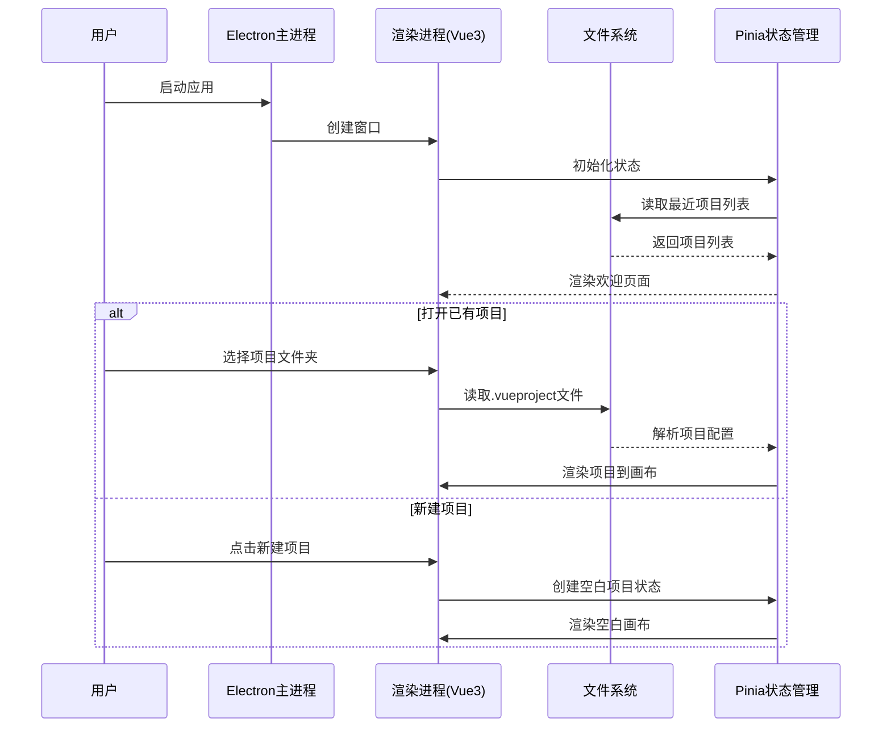
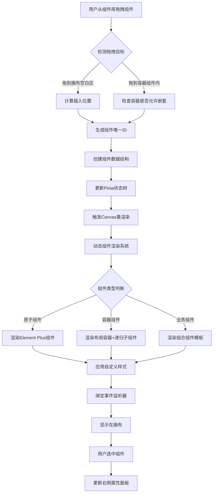
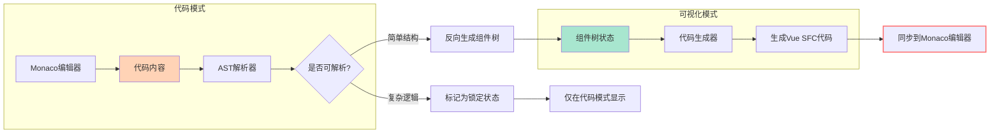
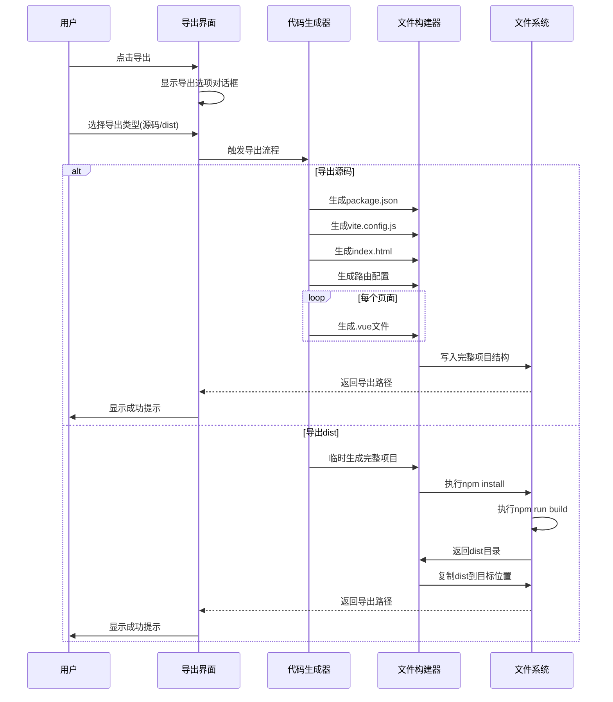
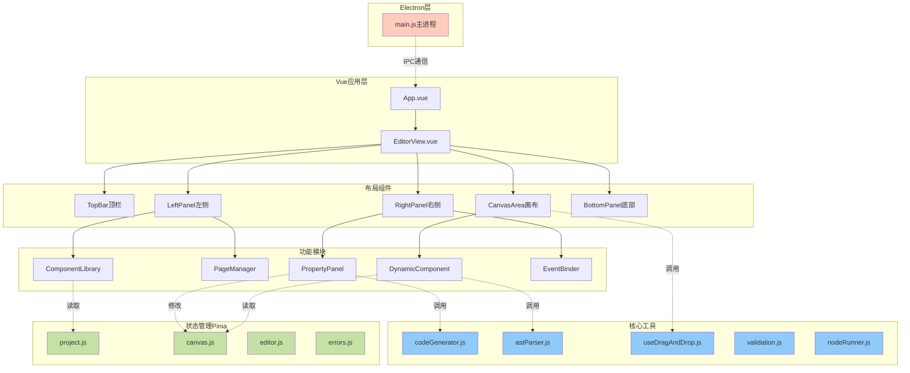
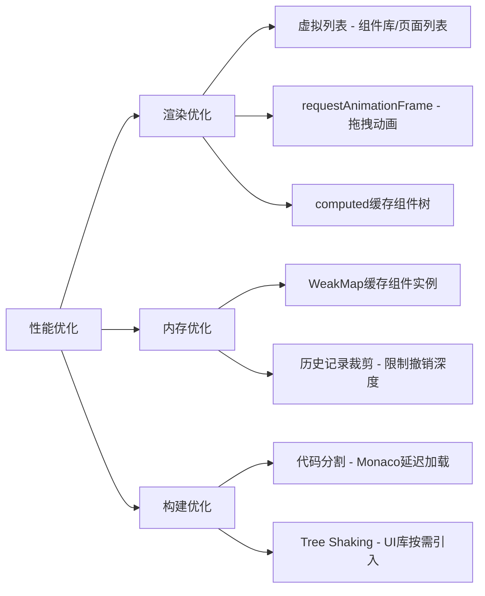
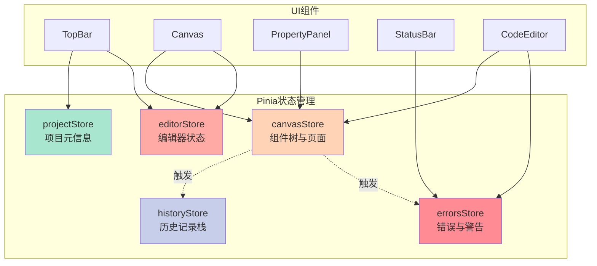

# V1.4 更新日志 (2025-12-04)

## 1. 需求更新

### 1.1 可视化背景修复 (Canvas Background Fix)
- **需求**: 修复可视化模式下背景高度受内部页面大小影响的问题，确保背景始终充满应用显示区域。
- **实现**: 强制 `.canvas-area` 占据 100% 宽高，并修正 CSS 布局。

### 1.2 代码预览缩放修复 (Preview Zoom Fix)
- **需求**: 修复代码模式下在预览页面内部按 `Ctrl + 滚轮` 无法触发缩放的问题。
- **技术**: 在 iframe 内部注入事件监听脚本，捕获 `wheel` 事件并通过 `postMessage` 转发给父窗口处理。

### 1.3 代码预览触控板支持 (Preview Touchpad)
- **需求**: 为代码模式预览添加触控板支持（主要是水平平移）。
- **实现**: 同样通过 `postMessage` 转发非缩放的 `wheel` 事件，父窗口识别水平分量进行平移。

### 1.4 折叠图标显示修复 (Collapse Icons Fix)
- **需求**: 修复资源管理器和属性检查器的折叠按钮图标不显示的问题。
- **原因**: `<component :is="...">` 使用字符串引用组件失败。
- **修复**: 直接绑定组件对象 (`:is="ArrowLeft"`).

## 2. 技术方案

### 2.1 背景布局
- **文件**: `src/components/canvas/CanvasArea.vue`
- **CSS**: `.canvas-area { width: 100%; height: 100%; }`

### 2.2 Iframe 事件穿透
- **文件**: `src/components/code-mode/CodeEditor.vue`
- **注入脚本**:
  ```javascript
  window.addEventListener('wheel', (e) => {
    if (e.ctrlKey || Math.abs(e.deltaX) > Math.abs(e.deltaY)) {
      e.preventDefault()
      window.parent.postMessage({ type: 'preview-wheel', ... }, '*')
    }
  }, { passive: false })
  ```
- **父窗口监听**: `window.addEventListener('message', handleIframeMessage)`

## 3. Todo List

1.  [x] 修改 `CanvasArea.vue`: 修复背景 CSS。
2.  [x] 修改 `CodeEditor.vue`: 注入 iframe 事件监听脚本。
3.  [x] 修改 `CodeEditor.vue`: 实现父窗口消息处理与缩放/平移逻辑。
4.  [x] 修改 `EditorView.vue`: 修复折叠图标绑定。

# V1.3 更新日志 (2025-12-04)

## 1. 需求更新

### 1.1 代码预览体验一致性 (Preview Consistency)
- **需求**: 代码模式下的预览背景应与可视化模式保持一致（深色背景+网格），以提供统一的视觉体验。
- **实现**: 同步 `CanvasArea` 的背景样式到 `CodeEditor` 的预览区域。

### 1.2 预览交互优化 (Interaction Fixes)
- **需求**: 解决代码模式预览中缩放/平移与内部滚动的冲突。
- **方案**: 
  - 移除无修饰键时的滚轮平移功能，恢复默认的页面滚动行为。
  - 保留 `Ctrl + Wheel` 进行缩放。
  - 保留 `Space + Drag` 进行平移。

### 1.3 视图重置 (Reset View)
- **需求**: 在可视化画布和代码预览中提供“重置视图”按钮，一键恢复居中和 100% 缩放。
- **交互**: 点击按钮 -> `panX=0, panY=0, zoom=100`.

### 1.4 折叠图标优化 (Collapse Icons)
- **需求**: 将侧边栏折叠按钮图标更改为更直观的方向箭头 (`<` 和 `>`)。

## 2. 技术方案

### 2.1 样式同步
- **文件**: `src/components/code-mode/CodeEditor.vue`
- **CSS**: 复制 `CanvasArea` 的 `.canvas-background` 样式到 `.preview-viewport`。

### 2.2 交互逻辑
- **文件**: `src/components/code-mode/CodeEditor.vue`
- **逻辑**: 修改 `handleWheel`，仅在 `e.ctrlKey` 为真时阻止默认行为并执行缩放。

### 2.3 重置功能
- **文件**: `src/components/canvas/CanvasArea.vue`, `src/components/code-mode/CodeEditor.vue`
- **实现**: 添加悬浮按钮 (Canvas) 和工具栏按钮 (Code)，绑定 `resetView` 方法。

## 3. Todo List

1.  [x] 修改 `CodeEditor.vue`: 更新预览背景样式。
2.  [x] 修改 `CodeEditor.vue`: 修复滚轮冲突。
3.  [x] 修改 `CodeEditor.vue`: 添加重置视图按钮。
4.  [x] 修改 `CanvasArea.vue`: 添加重置视图按钮。
5.  [x] 修改 `EditorView.vue`: 更新折叠图标为箭头。

# V1.2 更新日志 (2025-12-04)

## 1. 需求更新

### 1.1 触控板支持 (Touchpad Support)
- **需求**: 支持使用触控板双指滑动进行画布平移，无需按住空格键。
- **交互**: 双指在画布上滑动 -> 画布跟随平移。
- **技术**: 监听 `wheel` 事件，当无 Ctrl/Meta 键按下时，将 `deltaX/Y` 映射为平移量。

### 1.2 多端预览切换 (Device Preview)
- **需求**: 在顶部工具栏添加切换按钮，快速预览桌面、平板、手机尺寸。
- **交互**: 点击图标切换画布宽度。
- **尺寸定义**:
  - Desktop: 1280px (自适应)
  - Tablet: 768px
  - Mobile: 375px

### 1.3 代码同步优化 (Code Sync)
- **需求**: 修复代码模式修改无法同步回可视化模式的问题。
- **优化**: 增强 `syncToCanvas` 解析逻辑，支持 `v-model` 映射，修复子组件递归解析问题。

### 1.4 UI 细节优化
- **需求**: 为左右侧面板的折叠按钮添加直观的图标 (Expand/Fold)。

### 1.5 代码模式预览优化 (Code Mode Preview)
- **需求**: 代码模式下的预览窗口应具备与可视化模式相同的交互体验（平移、缩放、设备尺寸切换）。
- **交互**: 
  - 鼠标滚轮/触控板 -> 平移/缩放。
  - 顶部设备切换 -> 预览窗口宽度响应。
- **原型**:
  ```
  +--------------------------------------------------+
  |  Code Editor      |      Preview Panel           |
  |                   |  +-----------------------+   |
  |  <template>       |  |      [Mobile]         |   |
  |    <div>...       |  |    +-------------+    |   |
  |                   |  |    |   Iframe    |    |   |
  |                   |  |    |             |    |   |
  |                   |  |    +-------------+    |   |
  |                   |  +-----------------------+   |
  +--------------------------------------------------+
  ```

### 1.6 代码模式自动同步 (Auto Sync)
- **需求**: 离开代码模式（切换回可视化模式）时，自动将代码变更同步到画布，防止修改丢失。
- **逻辑**: 在组件卸载前 (`onBeforeUnmount`) 自动触发 `syncToCanvas`。

## 2. 技术方案

### 2.1 触控板平移
- **文件**: `src/components/canvas/CanvasArea.vue`
- **逻辑**:
  ```javascript
  const handleWheel = (e) => {
    if (e.ctrlKey || e.metaKey) {
      // Zoom logic
    } else {
      // Pan logic
      panX.value -= e.deltaX
      panY.value -= e.deltaY
    }
  }
  ```

### 2.2 设备切换
- **文件**: `src/components/layout/TopBar.vue`
- **UI**: 添加三个图标按钮，绑定 `editorStore.setDeviceMode`。

### 2.3 代码同步
- **文件**: `src/components/code-mode/CodeEditor.vue`
- **逻辑**: 更新 `parseNodeV2`，增加对 `v-model` 的处理，确保组件树构建正确。

### 2.4 代码预览增强
- **文件**: `src/components/code-mode/CodeEditor.vue`
- **架构**: 
  - 在 `preview-panel` 中引入 `transform-layer` 和 `device-wrapper` 结构。
  - 复用 `CanvasArea` 的平移/缩放逻辑 (panX, panY, zoom)。
  - 绑定 `editorStore.deviceMode` 控制宽度。

### 2.5 自动同步
- **文件**: `src/components/code-mode/CodeEditor.vue`
- **逻辑**:
  ```javascript
  onBeforeUnmount(async () => {
    await syncToCanvas(true) // silent mode
    // ... cleanup
  })
  ```

## 3. Todo List

1.  [x] 修改 `CanvasArea.vue`: 实现触控板平移。
2.  [x] 修改 `TopBar.vue`: 添加设备切换按钮。
3.  [x] 修改 `EditorView.vue`: 更新折叠按钮图标。
4.  [x] 修改 `CodeEditor.vue`: 修复代码同步逻辑。
5.  [ ] 修改 `CodeEditor.vue`: 实现预览区域的平移、缩放、设备尺寸响应。
6.  [ ] 修改 `CodeEditor.vue`: 添加 `onBeforeUnmount` 自动同步逻辑。

# V1.1 更新日志 (2025-12-04)

## 1. 需求更新

### 1.1 画布交互优化 (Canvas Panning)
- **现状问题**: 按下空格键拖动画布时，如果鼠标移动过快超出画布区域，或者经过某些特定元素，拖动会中断或失效。
- **优化目标**: 实现全局平滑拖动。按下空格键并按下鼠标左键后，无论鼠标移动到屏幕何处，画布都应跟随移动，直到松开鼠标左键。
- **交互原型**:
  ```
  [ 按住 Space + 鼠标左键拖动 ]
       |
       v
  +----------------------------------+
  |           Canvas Area            |
  |                                  |
  |      [ Component ]               |
  |            ^                     |
  |            | (Mouse moves out)   |
  |            |                     |
  +------------|---------------------+
               |
        (Still Panning)
  ```

### 1.2 组件重排优化 (Component Reordering)
- **现状问题**: 从组件库拖入新组件正常，但拖动已放置在画布上的组件进行重新排列（排序或移动到其他容器）失效。
- **优化目标**: 
  - 选中画布上的组件并拖动时，应显示"移动"光标。
  - 拖动经过其他组件或容器时，应正确显示插入位置指示线。
  - 松开鼠标后，组件应移动到新位置。
- **交互原型**:
  ```
  [ Component A ]  [ Component B ]
         |
    (Drag A)
         |
         v
  [ Component B ]  | (Drop Indicator)
                   |
             [ Component A ] (Moved)
  ```

## 2. 技术方案

### 2.1 画布平移 (Canvas Panning)
- **文件**: `src/components/canvas/CanvasArea.vue`
- **方案**:
  - 在 `handleMouseDown` 中，当开始平移时，使用 `window.addEventListener` 绑定 `mousemove` 和 `mouseup` 事件。
  - 这确保了即使鼠标移出 `.canvas-area` DOM 元素，事件仍能被捕获。
  - 在 `handleMouseUp` (及 `mouseleave` 的清理逻辑中) 移除 `window` 上的监听器。
  - 移除模板中绑定在 `div` 上的 `@mousemove` 和 `@mouseup` (或保留作为 fallback，但主要逻辑移至 window handler)。

### 2.2 组件重排 (Component Reordering)
- **文件**: 
  - `src/components/canvas/CanvasArea.vue`
  - `src/components/canvas/DynamicComponent.vue`
- **方案**:
  - **识别移动操作**: 在 `dragover` 事件中，由于安全限制无法直接读取 `dataTransfer.getData`，改用 `e.dataTransfer.types.includes('move-component-id')` 来判断是否为组件移动操作。
  - **设置 DropEffect**: 
    - 如果检测到移动操作，显式设置 `e.dataTransfer.dropEffect = 'move'`。
    - 否则默认为 `'copy'` (用于从组件库添加)。
  - **DragStart 兼容性**: 在 `DynamicComponent.vue` 的 `handleDragStart` 中，设置 `e.dataTransfer.effectAllowed = 'all'` (或 `'copyMove'`)，以确保浏览器允许在不同 `dropEffect` 场景下的拖放。

## 3. Todo List

1.  [ ] 修改 `src/components/canvas/CanvasArea.vue`: 实现基于 `window` 的画布平移事件监听。
2.  [ ] 修改 `src/components/canvas/CanvasArea.vue`: 优化 `handleDragOver` 逻辑，使用 `types.includes` 检测移动操作。
3.  [ ] 修改 `src/components/canvas/DynamicComponent.vue`: 优化 `handleDragStart` 设置 `effectAllowed`。
4.  [ ] 修改 `src/components/canvas/DynamicComponent.vue`: 优化 `handleDragOver` 逻辑，使用 `types.includes` 检测移动操作并设置正确的 `dropEffect`。
5.  [ ] 验证画布平移功能（包括移出区域）。
6.  [ ] 验证组件重排功能（同级排序、跨容器移动）。

# VueDrag Builder PRD（产品需求文档）

## 一、产品概述

### 1.1 核心目标（Mission）
为前端小白打造零配置的 Vue3 可视化开发平台，让不熟悉 Vue 的初学者也能通过拖拽和简单配置，快速构建专业级的 Vue3 应用（原型 Demo、博客、展示页等），并一键导出为标准 Vite + Vue3 工程或构建产物。

### 1.2 产品定位
- 形态：Electron 桌面应用
- 技术栈：Electron + Vue3 + Vite + Pinia + Element Plus（或可选 UI 库）+ Monaco Editor
- 核心卖点：
  - 零配置开箱即用
  - 基于 Vue3 的强大组件库（原子组件 + 业务模板）
  - 支持拖拽式搭建 + 代码编辑双模式
  - 极简、专业兼具的 IDE 风格 UI

---

## 二、用户画像（Persona）

### 2.1 主要用户
**前端入门开发者 / 学生 / 设计师转前端**
- 掌握基础 HTML/CSS
- 对 Vue3、组件化开发、工程化（Vite、打包配置等）不熟悉
- 需要快速完成可视化页面：作品集、展示页、简单的业务 Demo

### 2.2 核心痛点
1. Vue/Vite 项目初始化与配置成本高，不知道从哪里开始。
2. 纯代码写 Vue 组件周期长，不利于快速验证想法。
3. 响应式布局（Flex/Grid）细节、兼容性、样式调整繁琐。
4. 需要可直接导出的标准 Vue3 项目结构，以便后续手写扩展。
5. 希望在可视化搭建的同时学习 Vue3 的代码结构和最佳实践。

---

## 三、产品版本规划

### 3.1 V1：最小可行产品（MVP）

> 布局采用：**方案 C 的 IDE 风格布局 + 方案 A 的快速原型设计理念**，底部状态栏/终端面板采用 VSCode 风格。

#### 3.1.1 MVP 核心功能

1. **项目管理系统**
   - 新建/打开/保存项目（`.vueproject` 格式文件）。
   - 选择本地文件夹作为项目根目录（参考 VSCode 选择工作区行为）。
   - 自动保存机制：编辑器失焦时触发保存。
   - 最近项目列表：记录最近打开的项目（如 5 个）。
   - 项目级配置：
     - UI 库选择（如：Element Plus / Naive UI / 自定义简单模板）。
     - npm 镜像源配置（默认使用淘宝镜像，支持用户自定义镜像地址）。
   - 自动保存机制：
     - 编辑器失焦时触发保存，防抖延迟 500ms。
     - 代码模式下仅在语法校验通过后保存。
     - 引入草稿恢复机制（类似 VSCode Hot Exit），应用崩溃后可恢复未保存内容。

2. **主界面布局（IDE 风格 + 极简原型理念）**
   - 顶部菜单栏/工具栏：
     - 应用标题：`VueDrag Builder`
     - 按钮：撤销、重做、保存、预览、导出、切换模式（可视化 / 代码）、项目设置。
   - 三栏布局：
     - 左侧：组件库 + 页面管理（类似 Photoshop 图层管理）。
     - 中间：画布区域（实时预览，所见即所得）。
     - 右侧：属性面板（样式、布局、事件、数据相关配置）。
   - 底部：状态栏 + 终端面板（仿 VSCode 风格）：
     - 状态栏：显示项目信息、错误/警告数量、当前模式、保存状态等。
     - 终端面板：Tab 切换（终端、问题、输出），默认折叠，点击状态栏错误提示可展开。
     - 实时显示构建日志、语法错误、运行时警告等信息。

3. **页面与路由管理（多页面支持，MVP 必须）**
   - 页面列表（左侧面板的一个标签页）：
     - 展示页面集合，如：`首页`、`关于我们` 等。
     - 每个页面有唯一 ID（如：`page_001`）与路由路径（如：`/`, `/about`）。
     - 支持新增、删除、重命名页面。
     - 支持页面排序（决定路由与导航顺序）。
   - 页面跳转逻辑：
     - 通过组件（如按钮）绑定跳转事件，根据页面 ID/路由进行跳转。
     - 支持路由传参（如：query 参数、路径参数），在事件配置中可设置传递的数据。
   - 自动生成 Vue Router 配置（导出项目时使用）。

4. **组件拖拽与布局系统（基于 Flexbox / Grid 的约束布局）**
   - 左侧组件库面板：
     - 分类展示组件（容器类、基础类、表单类、业务模块等）。
   - 拖拽交互：
     - 用户可从左侧组件列表拖拽到中间画布区域。
     - 组件可拖入容器组件内部（支持嵌套）。
     - 显示插入位置高亮（蓝色插入线提示，精确指示插入点）。
     - 对于 Grid 布局容器，支持精确选择目标行列位置。
   - 布局特性：
     - 支持 Flex 布局容器：水平/垂直方向、对齐方式、间距等。
     - 支持 Grid 布局容器：列数、行高、间距、对齐方式。
     - 基于约束布局（而非完全自由绝对定位），后续版本可扩展自由布局。
     - 子组件数量无限制（依赖浏览器性能，大量组件时自动优化渲染）。
   - 尺寸调整：
     - 支持拖拽组件边缘调整宽高（在约束布局规则内）。
   - 组件操作：
     - 选中、删除、复制、粘贴。
     - 键盘快捷键支持（如 Delete 删除，Ctrl+Z 撤销，Ctrl+Y 重做）。

5. **组件库（原子组件 + 业务模块，MVP 必须全覆盖）**

   **原子组件（基础/表单/展示）：**
   - Button
   - Input / Textarea
   - Image
   - Text / Heading
   - Link
   - Divider
   - Icon
   - Video
   - Checkbox / Radio
   - Select 下拉框
   - Switch 开关
   - DatePicker

   **容器组件：**
   - Container（基础容器）
   - Flex 布局容器
   - Grid 布局容器

   **业务模块（复合组件）：**
   - 登录表单（用户名 + 密码 + 登录按钮）
   - 数据列表 / Table（支持基本分页展示示意）

   **业务模块为组件组合实现：**
   - 使用原子组件组合而成，方便后续用户拆分或自定义。

6. **可视化模式 - 属性配置面板（样式 / 布局 / 交互 / 事件）**

   - 选中组件后，右侧显示对应的配置项。

   **样式类（基础 CSS 修改，MVP 必须）：**
   - 文本内容（Text/Heading/Button 等组件）。
   - 颜色：背景色、文字色、边框色（颜色选择器）。
   - 尺寸：宽度、高度、内边距（padding）。
   - 圆角：border-radius。
   - 边框：宽度、样式、颜色。
   - 字体：字号（font-size）、粗细（font-weight）、行高、对齐方式等。

   **布局类：**
   - 外边距 margin（支持上下左右独立设置）。
   - Flex 设置（方向、对齐、间距等）。
   - Grid 设置（列数、行间距、列间距等）。
   - 显示/隐藏开关（display / visibility 语义）。

   **交互类：**
   - Hover 效果（颜色变化、阴影等简单态）。
   - 禁用状态（禁用交互）。
   - 加载状态（按钮 loading 等）。

   **事件绑定（预设 + 自定义，MVP 必须）：**
   - 预设动作：
     - 页面跳转（选择目标页面 ID/路由，支持传递 query 参数和路径参数）。
     - 打开弹窗（简单对话框/模态框）。
     - 显示/隐藏某组件（支持基于组件 ID 的直接控制，也支持条件表达式）。
     - 提交表单（完整校验库支持）：
       - **校验规则类型**：
         - `required`：必填校验（boolean）
         - `minLength` / `maxLength`：字符串长度限制（number）
         - `min` / `max`：数值范围限制（number）
         - `pattern`：正则表达式校验（RegExp 或字符串）
         - `email`：邮箱格式校验（内置规则）
         - `url`：URL 格式校验（内置规则）
         - `phone`：手机号校验（内置规则，支持国际化）
         - `custom`：自定义校验函数（接收 value，返回 true/false 或错误消息）
       - **校验时机**：
         - 实时校验（onChange）
         - 失焦校验（onBlur）
         - 提交时校验（onSubmit）
       - **错误处理**：
         - 显示错误提示文本（可自定义位置：输入框下方/顶部通知）
         - 高亮错误字段（红色边框）
         - 阻止表单提交（校验失败时）
   - 自定义 JS：
     - 为指定组件（如按钮）附加自定义 JavaScript 代码（在 script 块中生成对应 handler）。

7. **代码模式（独立全屏模式，CodePen 风格）**

   - 模式切换：
     - 在顶部工具栏通过“可视化 / 代码”按钮切换。
   - 布局结构：
     - 上方为三个代码区域（并列或标签切换）：
       - Template 区域（HTML/Vue 模板）。
       - Style 区域（CSS/SCSS）。
       - Script 区域（JavaScript，默认使用 `<script setup>`）。
     - 下方为实时预览区域（热重载预览）。
   - 编辑器：
     - 使用 Monaco Editor（VSCode 同款）。
     - 提供语法高亮、自动补全、错误提示等基础能力。
   - 双向同步机制（MVP 必须）：
     - **可视化 → 代码：**
       - 基于当前组件树 + 属性 + 样式 + 事件，生成对应 Vue SFC 代码（template/style/script）。
       - 实时同步到 Monaco Editor 中展示。
     - **代码 → 可视化：**
       - 用户在代码模式中进行编辑后：
         - 通过 AST 解析 Template/Script/Style 内容。
         - 能识别的内容（组件结构、基础样式、简单事件绑定、v-if/v-show、v-for、插槽）同步回组件树。
         - 复杂逻辑（如深层嵌套的 computed、watch、复杂自定义函数）以"锁定区域/锁标记"形式存在。
       - 同步支持范围（V1 完整支持）：
         - ✅ 静态组件与静态属性
         - ✅ 简单事件绑定（@click="handleClick"）
         - ✅ 动态属性（:disabled="变量"）- 可识别并锁定
         - ✅ v-if / v-show 条件渲染
         - ✅ v-for 循环渲染
         - ✅ 插槽（slot）
         - ⚠️ computed / watch - 保留但锁定，仅在代码模式编辑
     - 冲突与限制：
       - 若代码存在语法错误，将阻止回到可视化模式，并在底部状态栏 + 问题面板显示详细错误信息。
       - 冲突处理机制（方案2）：保留"孤儿代码"（如删除组件后残留的事件函数）但标记为"未使用"，在问题面板提示用户。
       - 切换模式前，如检测到有潜在丢失的复杂逻辑，需提示用户确认（如："复杂逻辑将仅在代码模式生效，在可视化中标记为锁定状态"）。

8. **实时预览与热重载（MVP 必须）**
   - 可视化模式下：
     - 对组件属性、样式的修改立刻反映在画布渲染中。
   - 代码模式下：
     - 保存或停止输入短暂时间后（防抖），刷新下方预览区域。
   - 保证错误时预览区域不会崩溃（显示错误信息、提供恢复按钮）。

9. **导出功能（双形式导出，MVP 必须）**
   - 导出为标准 Vite + Vue3 工程源码：
     - 生成 `package.json`（包含 Vue3、Vite、UI 库等依赖）。
     - 生成 `vite.config.js`。
     - 生成 `index.html`。
     - 生成 `src/main.js`、`src/App.vue`、`src/router/index.js`。
     - 生成每个页面对应的 `.vue` 文件及必要的组件文件。
   - 导出为已构建的 `dist/` 目录：
     - 依赖安装策略：
       - 应用内嵌 Node.js 环境（Electron 打包时集成，确保用户无需安装 Node.js）。
       - 默认使用淘宝镜像（https://registry.npmmirror.com）。
       - 支持用户在设置中自定义镜像源地址。
       - npm install 失败时：
         - 提供"切换镜像源"选项（淘宝/官方/自定义）。
         - 显示"重试"按钮。
         - 底部终端实时显示安装日志，帮助排查问题。
     - 构建体验：
       - 显示进度条（解析依赖 → 安装 → 构建 → 完成）。
       - 允许用户在构建时继续编辑项目（构建在后台进行）。
       - 构建失败时保留临时文件（在项目目录的 `.build-temp/` 中），供用户排查或手动修复。
   - 导出前需做基本检查（依赖完整性等），失败时显示明确错误原因。

10. **底部状态栏与终端（VSCode 风格，MVP 必须）**
    - 状态栏（固定显示在底部）：
      - 左侧：项目名称、当前页面、当前模式（可视化/代码）、保存状态（已保存/未保存）。
      - 中间：错误数量、警告数量（点击可展开问题面板）。
      - 右侧：Node.js 版本、npm 镜像源、编码格式、语言模式。
    - 终端面板（默认折叠）：
      - 风格仿照 VSCode 的终端/问题/输出面板。
      - 提供 Tab：
        - **终端**：执行命令的交互式终端（可执行 npm、git 等命令）。
        - **问题**：显示语法错误、未使用的代码、校验失败等问题，支持点击跳转到对应位置。
        - **输出**：显示构建日志、导出日志、系统通知等。
      - 默认折叠，仅在以下情况自动展开：
        - 代码存在语法错误。
        - 导出/构建操作开始。
        - 用户点击状态栏的错误/警告提示。
      - 支持手动调整面板高度、最大化/最小化。

---

### 3.2 V2 及以后版本（Future Releases）

> 以下为未来规划功能，不属于 MVP 实现范围，但需要在架构设计中预留扩展点。

1. **V2.0 - 数据与 API 集成**
   - Mock 数据管理（内置 JSON 编辑器）。
   - API 接口配置（RESTful，支持 GET/POST 等）。
   - 组件级数据绑定（表格、列表、图表等组件绑定数据源）。
   - Axios 自动注入与统一请求封装。
   - 状态管理增强：引入 Pinia store 模块化管理业务数据。

2. **V2.5 - 自由布局与高级样式**
   - 支持绝对定位与自由布局模式（类似设计工具）。
   - 响应式断点管理（不同屏幕尺寸下使用不同布局/样式）。
   - CSS 动画配置可视化（过渡、关键帧）。
   - 主题系统：一键切换主题，支持主题导出。

3. **V3.0 - 协作与生态**
   - 自定义组件导入（本地/NPM 包中组件）。
   - 组件市场（社区共享组件库）。
   - Git 版本控制集成（提交、回滚、分支信息展示）。
   - 在线协同编辑（多用户实时协作）。

4. **V3.5 - 智能化辅助**
   - AI 文本生成页面结构（自然语言 → 组件树）。
   - 设计稿识别（Figma/Sketch 导入，半自动生成页面）。
   - 智能布局建议（推荐合理布局与组件组合）。

---

## 四、关键业务逻辑（Business Rules）

### 4.1 项目结构与 .vueproject 数据格式

`.vueproject` 文件以 JSON 格式存储项目信息，示例：

```json
{
  "projectName": "我的项目",
  "uiLibrary": "element-plus",
  "npmRegistry": "https://registry.npmmirror.com",
  "pages": [
    {
      "id": "page_001",
      "name": "首页",
      "route": "/",
      "componentTree": [
        {
          "id": "comp_001",
          "type": "Container",
          "parentId": null,
          "props": {},
          "styles": {},
          "events": [],
          "children": ["comp_002", "comp_003"]
        },
        {
          "id": "comp_002",
          "type": "Button",
          "parentId": "comp_001",
          "props": { "label": "点击我" },
          "styles": { "width": "120px" },
          "events": [
            {
              "type": "click",
              "action": "navigateTo",
              "params": { 
                "pageId": "page_002",
                "query": { "from": "home" }
              }
            }
          ],
          "children": []
        }
      ]
    }
  ],
  "globalStyles": "/* 全局CSS */",
  "dependencies": {
    "vue": "^3.x.x",
    "vite": "^5.x.x"
  },
  "autoSave": true,
  "lastSaved": "2025-12-03T10:30:00Z"
}
```

### 4.2 组件数据结构

统一的组件数据结构（在状态树中）：

```js
{
  id: "component_uuid",
  type: "Button",          // 组件类型（在组件注册表中有定义）
  parentId: "parent_uuid", // 父组件 ID，根节点为 null
  props: {                  // 与 Vue 组件绑定的 props
    label: "点击我",
    type: "primary"
  },
  styles: {                 // 内联样式或 class 生成依据
    width: "120px",
    backgroundColor: "#409EFF"
  },
  events: [                 // 事件绑定
    {
      type: "click",      // 事件类型
      action: "navigateTo",
      params: { 
        pageId: "page_002",
        query: { "from": "home" }  // 支持路由传参
      }
    },
    {
      type: "click",
      action: "toggleComponent",
      params: {
        componentId: "comp_005",
        condition: "formData.agree === true"  // 支持条件表达式
      }
    }
  ],
  children: ["child_1", "child_2"], // 子组件 ID 列表
  locked: false  // 是否为代码模式专属（锁定状态）
}
```

### 4.2.1 组件注册表数据结构

每个组件在 `componentRegistry.js` 中的定义示例：

```js
export const componentRegistry = {
  Button: {
    // 基础信息
    name: 'Button',
    displayName: '按钮',
    category: '基础组件',
    icon: 'button.svg',
    
    // 默认配置
    defaultProps: {
      label: '按钮',
      type: 'primary',
      size: 'medium'
    },
    
    // 属性配置面板
    propertySchema: {
      label: {
        type: 'string',
        label: '按钮文字',
        control: 'input'
      },
      type: {
        type: 'string',
        label: '按钮类型',
        control: 'select',
        options: ['primary', 'success', 'warning', 'danger', 'info', 'text']
      },
      disabled: {
        type: 'boolean',
        label: '禁用状态',
        control: 'switch'
      }
    },
    
    // 样式配置面板
    styleSchema: {
      width: { type: 'size', label: '宽度', control: 'input' },
      backgroundColor: { type: 'color', label: '背景色', control: 'colorPicker' }
    },
    
    // 支持的事件
    events: ['click', 'hover', 'focus'],
    
    // 是否允许有子组件
    canHaveChildren: false,
    
    // 可以放入哪些容器
    allowedParents: ['Container', 'Flex', 'Grid'],
    
    // 对应的 Element Plus 组件
    component: 'ElButton'
  },
  
  // 容器组件示例
  Container: {
    name: 'Container',
    displayName: '容器',
    category: '容器组件',
    canHaveChildren: true,
    allowedChildren: '*',  // 接受所有组件
    defaultProps: {},
    propertySchema: {},
    styleSchema: {
      padding: { type: 'spacing', label: '内边距', control: 'spacing' },
      backgroundColor: { type: 'color', label: '背景色', control: 'colorPicker' }
    },
    events: [],
    component: 'div'
  }
}
```

### 4.3 双向同步业务规则

1. **可视化 → 代码**
   - 从当前页面的组件树出发，生成：
     - `<template>`：根据组件树递归生成对应的 Vue 模板结构。
     - `<script setup>`：
       - 生成必要的 import（组件、路由等）。
       - 生成事件处理函数（预设动作 + 自定义 JS）。
     - `<style scoped>`：
       - 根据组件的 `styles`、全局的 `globalStyles` 生成 CSS。

2. **代码 → 可视化**
   - 使用 AST 解析 `template`、`script`、`style`：
     - 尝试还原组件树：
       - ✅ **完全支持映射回组件树**：
         - 静态组件结构（不包含复杂指令/表达式）。
         - 静态属性与动态属性（`:prop="variable"`）。
         - 简单事件（如 `@click="handleClick"` 且 handleClick 逻辑简单）。
         - 条件渲染（`v-if`、`v-show`）。
         - 循环渲染（`v-for`）。
         - 插槽（`<slot>` 和 `<template #slotName>`）。
       - ⚠️ **保留但锁定，仅在代码模式编辑**：
         - 复杂模板表达式（如多重嵌套的三元表达式）。
         - 复杂脚本逻辑（如 computed、watch、自定义 hooks、复杂函数）。
     - 处理策略：
       - 标记为"代码模式专属逻辑"，在可视化模式中显示锁图标，不允许直接编辑。
       - 在右侧属性面板显示提示："此部分由代码模式管理，点击切换到代码模式编辑"。

3. **模式切换规则**
   - 从可视化 → 代码：
     - 始终安全，生成的代码保证可运行。
   - 从代码 → 可视化：
     - 若存在语法错误：
       - 阻止切换，底部状态栏显示"❌ 3 个错误"。
       - 问题面板自动展开，显示错误列表（文件、行号、错误描述）。
       - 提供"修复建议"或"撤销更改"按钮。
     - 若存在复杂或不完全可解析的结构：
       - 允许切换，但弹窗提示："检测到高级代码特性，部分内容将锁定，仅可在代码模式编辑"。
       - 在可视化模式中，锁定的组件/区域显示特殊标记（如锁图标 + 灰色背景）。

4. **冲突处理机制（方案 2）**
   - **场景示例**：用户在可视化中删除了一个按钮，但代码模式中有该按钮的事件处理函数。
   - **处理方式**：
     - 保留"孤儿代码"（未被任何组件使用的函数、变量、import）。
     - 在问题面板标记为"未使用的代码"（黄色警告）。
     - 提示用户："handleButtonClick 函数未被使用，是否删除？"
     - 提供"一键清理"按钮，自动移除所有未使用的代码。

5. **语法错误提示（底部状态栏 + 问题面板）**
   - **位置**：
     - 底部状态栏：显示错误总数（如"❌ 3"），点击展开问题面板。
     - 问题面板：详细列表，包含：
       - 文件名（如 `首页.vue`）
       - 行号与列号（如 `第 12 行，第 5 列`）
       - 错误类型（语法错误 / 类型错误 / 校验失败）
       - 错误描述（如"缺少闭合标签 </el-button>"）
       - 快速操作（"跳转到错误位置" / "查看建议"）
   - **Monaco Editor 内联提示**：
     - 错误行下方显示红色波浪线。
     - Hover 时显示错误详情。
   - **阻止行为**：
     - 存在语法错误时，禁用"切换到可视化"按钮，并显示提示："修复所有错误后才能切换模式"。

### 4.4 布局与嵌套规则

- 布局基于 Flex / Grid 容器：
  - Flex 容器：
    - 允许任意数量子组件（无限制）。
    - 支持方向（row/column）、对齐方式、space-between 等。
  - Grid 容器：
    - 支持设置列数、列宽、行高、gap 等。
    - 拖拽插入时支持精确选择目标行列位置（通过高亮网格 + 坐标提示）。
- 嵌套规则：
  - 容器组件可作为其他容器或普通组件的子组件。
  - 不限制嵌套深度（依赖浏览器性能，深层嵌套时自动优化渲染）。
- 拖拽对齐规则：
  - 拖拽过程中显示蓝色插入线，精确指示组件将被插入的位置。
  - 插入线位置基于鼠标最接近的子组件边缘（上/下或左/右，取决于布局方向）。
  - Grid 容器中显示网格高亮，鼠标悬停的格子以半透明蓝色标记。

### 4.5 导出规则

- 导出工程结构：
  - `package.json`：写入 Vue3、Vite、选定 UI 库及相关依赖。
  - `vite.config.js`：标准 Vite 配置（Vue 插件等）。
  - `src/` 目录：
    - `main.js`、`App.vue`。
    - `router/index.js`（根据页面配置生成路由，支持路由传参）。
    - `pages/` 下为每个页面的 `.vue` 文件。
    - `components/` 下为复用组件（如 Header、Form 容器等）。
  - `public/`：静态资源目录。

- 导出 dist（构建产物）：
  - **依赖安装策略**：
    - 应用内嵌 Node.js 环境（Electron 打包时集成，用户无需手动安装 Node.js）。
    - 默认 npm 镜像源：淘宝镜像（https://registry.npmmirror.com）。
    - 支持用户在设置中自定义镜像源地址（如公司内网镜像）。
    - npm install 失败时的处理：
      - 提供镜像源切换选项（淘宝/官方/自定义）。
      - 显示"重试"按钮，允许用户多次尝试。
      - 底部终端实时显示安装日志，帮助排查依赖冲突或网络问题。
  - **构建体验**：
    - 显示进度条，包含以下阶段：
      - 📦 解析依赖（10%）
      - ⬇️ 下载依赖（10% - 60%）
      - 🔨 执行构建（60% - 90%）
      - ✅ 完成导出（90% - 100%）
    - 允许用户在构建时继续编辑项目（构建在后台 Worker 线程进行）。
    - 构建失败时：
      - 保留临时文件到项目目录的 `.build-temp/` 文件夹。
      - 显示详细错误日志，指出失败原因（如缺少依赖、语法错误）。
      - 提供"打开临时目录"按钮，供用户手动排查或修复。
  - 成功后将 `dist/` 文件夹复制到用户指定路径，并提示："构建成功！dist 文件夹已保存到 [路径]"。

---

## 五、数据契约（Data Contract）

### 5.1 输入数据

1. **用户操作数据**
   - 拖拽信息（起点组件类型、目标区域、索引等）。
   - 属性修改（组件 props、styles、events）。
   - 代码编辑（Template/Script/Style 文本内容）。

2. **项目配置数据**
   - 项目名称、UI 库选择。
   - 页面列表与页面路由配置。
   - 全局样式和依赖信息。

### 5.2 输出数据

1. **本地项目文件**
   - `.vueproject` 项目文件（JSON）。
   - 项目目录中的缓存/临时构建文件（内部使用）。

2. **导出产物**
   - 标准 Vite + Vue3 源码工程目录。
   - 可直接部署的 `dist/` 目录。

### 5.3 内部数据流（高层视角）

```text
用户操作 → 组件树状态（Pinia） → 画布渲染（CanvasArea）
                        ↓
                   代码生成器（codeGenerator） → 代码编辑器显示（Monaco）
                        ↑
                  AST 解析器（astParser） ← 代码模式编辑内容
```

---

## 六、MVP 界面原型（选定方案）

> 采用 **C 的 IDE 布局 + A 的快速原型理念**，终端默认折叠。

### 6.1 主编辑器界面 ASCII 原型

```text
╔════════════════════════════════════════════════════════════════════════════════════════╗
║ 文件 编辑 视图 工具 帮助                                          VueDrag Builder v1.0  ║
╠════════════════════════════════════════════════════════════════════════════════════════╣
║ ⟲  ⟳  💾  👁️  📤  |  [🖼️ 可视化]  [</>代码]  |  🖥️  📱  📱  |  100% ▼              ║
╠═══════╦════════════════════════════════════════════════════════════════╦══════════════╣
║       ║                                                                ║              ║
║ 资源  ║                       画布 - 首页.vue                           ║   检查器     ║
║       ║ ┌────────────────────────────────────────────────────────────┐ ║              ║
║ ▼ 组件║ │                                                            │ ║ ▼ 属性       ║
║ 搜索: ║ │     ┏━━━━━━━━━━━━━━━━━━━━━━━━━━━━━━━━━━┓                │ ║              ║
║ [....]║ │     ┃  Header 导航栏                   ┃                │ ║ ID:          ║
║       ║ │     ┗━━━━━━━━━━━━━━━━━━━━━━━━━━━━━━━━━━┛                │ ║ btn_001      ║
║ 容器  ║ │                                                            │ ║              ║
║ ├─Box ║ │     ┌──────────────────────────────────┐                │ ║ Label:       ║
║ ├─Flex║ │     │  欢迎使用 VueDrag Builder         │                │ ║ [登录____]   ║
║ └─Grid║ │     │                                  │                │ ║              ║
║       ║ │     │  ┌────────┐  ┌────────┐         │                │ ║ ▼ 布局       ║
║ 基础  ║ │     │  │ 按钮1   │  │ 按钮2   │         │                │ ║              ║
║ ├─Text║ │     │  └────────┘  └────────┘         │                │ ║ Display:     ║
║ ├─Btn ║ │     │                                  │                │ ║ [inline-flex]║
║ ├─Img ║ │     └──────────────────────────────────┘                │ ║              ║
║ ├─Link║ │                                                            │ ║ Margin:      ║
║ └─... ║ │                                                            │ ║ ┌─┬─┬─┬─┐   ║
║       ║ │     ┏━━━━━━━━━━━━━━━━━━━━━━━━━━━━━━━━━━┓                │ ║ │8│0│8│0│   ║
║ 表单  ║ │     ┃  Footer 页脚                     ┃                │ ║ └─┴─┴─┴─┘   ║
║ ├─Inp ║ │     ┗━━━━━━━━━━━━━━━━━━━━━━━━━━━━━━━━━━┛                │ ║              ║
║ ├─Sel ║ │                                                            │ ║ ▼ 样式       ║
║ └─... ║ │                                                            │ ║              ║
║       ║ └────────────────────────────────────────────────────────────┘ ║ Background:  ║
║ 业务  ║                                                                ║ [#409EFF] 🎨 ║
║ ├─登录 ║  <div class="flex-container">                                 ║              ║
║ └─表格 ║    <button class="primary">按钮1</button>                     ║ Border:      ║
║       ║  </div>                                                        ║ [1]px solid  ║
║ ▼ 页面║                                                                ║ [#ddd___] 🎨 ║
║       ║                                                                ║              ║
║ 🏠首页 ║                                                                ║ ▼ 事件       ║
║ 📄关于 ║                                                                ║              ║
║ + 新建║                                                                ║ @click       ║
║       ║                                                                ║ [添加动作▼]  ║
╠═══════╩════════════════════════════════════════════════════════════════╩══════════════╣
║ 📟 终端  ✓ 问题 (0)  ⚠️ 警告 (0)  ℹ️ 输出                                [—] [□] [×]  ║
║ (默认折叠，仅在需要时展开)                                                          ║
╚════════════════════════════════════════════════════════════════════════════════════════╝
```

该原型体现：
- 类 VSCode 的整体布局与交互心智模型。
- 左侧为“资源”视图（组件库 + 页面）。
- 中间为主画布区域，支持所见即所得。
- 右侧为检查器（属性、样式、事件）。
- 底部为终端与问题列表，但默认折叠以保持专注。

---

## 七、架构设计蓝图

### 7.1 核心流程图

#### 7.1.1 应用启动与项目加载流程（sequenceDiagram）



#### 7.1.2 组件拖拽与渲染流程（flowchart）



#### 7.1.3 双向同步机制（flowchart）



#### 7.1.4 导出流程（sequenceDiagram）



---

### 7.2 组件交互与模块关系

#### 7.2.1 目录结构规划

```text
vue-drag-builder/
├── electron/                    # Electron主进程
│   ├── main.js                  # 入口文件
│   ├── preload.js               # 预加载脚本
│   └── menu.js                  # 菜单配置
│
├── src/                         # Vue3渲染进程
│   ├── main.js                  # Vue应用入口
│   ├── App.vue                  # 根组件
│   │
│   ├── views/                   # 页面视图
│   │   ├── WelcomeView.vue      # 欢迎页（选择/新建项目）
│   │   └── EditorView.vue       # 主编辑器视图
│   │
│   ├── components/              # 核心组件
│   │   ├── layout/              # 布局相关
│   │   │   ├── TopBar.vue       # 顶部菜单栏
│   │   │   ├── Toolbar.vue      # 工具栏（撤销/重做等）
│   │   │   ├── LeftPanel.vue    # 左侧面板容器
│   │   │   ├── RightPanel.vue   # 右侧检查器面板
│   │   │   ├── StatusBar.vue    # 底部状态栏（VSCode 风格）
│   │   │   └── BottomPanel.vue  # 底部终端/问题/输出面板（可折叠）
│   │   │
│   │   ├── left-panel/
│   │   │   ├── ComponentLibrary.vue  # 组件库标签页
│   │   │   ├── ComponentItem.vue     # 可拖拽的组件项
│   │   │   └── PageManager.vue       # 页面管理标签页
│   │   │
│   │   ├── canvas/
│   │   │   ├── CanvasArea.vue        # 画布主区域
│   │   │   ├── DynamicComponent.vue  # 动态组件渲染器
│   │   │   ├── SelectionBox.vue      # 选中框高亮
│   │   │   └── DropZone.vue          # 拖拽目标区域
│   │   │
│   │   ├── right-panel/
│   │   │   ├── PropertyPanel.vue     # 属性配置面板
│   │   │   ├── StyleEditor.vue       # 样式编辑器
│   │   │   ├── EventBinder.vue       # 事件绑定器
│   │   │   └── QuickStylePreset.vue  # 快捷样式预设
│   │   │
│   │   └── code-mode/
│   │       ├── CodeEditor.vue        # 代码编辑模式（全屏）
│   │       ├── MonacoEditor.vue      # Monaco编辑器封装
│   │       └── PreviewPanel.vue      # 代码模式预览区
│   │
│   ├── composables/                  # 组合式函数
│   │   ├── useDragAndDrop.js         # 拖拽逻辑
│   │   ├── useComponentTree.js       # 组件树操作
│   │   ├── useCodeSync.js            # 双向同步逻辑
│   │   ├── useHistory.js             # 撤销/重做
│   │   └── useAutoSave.js            # 自动保存（防抖500ms + 草稿恢复）
│   │
│   ├── stores/                       # Pinia状态管理
│   │   ├── project.js                # 项目全局状态（含 npm 镜像配置）
│   │   ├── canvas.js                 # 画布状态（组件树）
│   │   ├── editor.js                 # 编辑器状态（选中、模式）
│   │   ├── history.js                # 历史记录栈
│   │   └── errors.js                 # 错误/警告状态（供状态栏和问题面板使用）
│   │
│   ├── utils/                        # 工具函数
│   │   ├── codeGenerator.js          # Vue代码生成器
│   │   ├── astParser.js              # AST解析器（支持 v-if/v-for/slot）
│   │   ├── fileExporter.js           # 文件导出器（源码 + dist）
│   │   ├── componentRegistry.js      # 组件注册表
│   │   ├── validation.js             # 表单校验库（完整校验规则）
│   │   └── nodeRunner.js             # 内嵌 Node.js 执行器（npm install/build）
│   │
│   └── config/
│       ├── components.json           # 组件库配置
│       └── templates.json            # 业务组件模板
│
├── public/
│   └── component-icons/             # 组件图标资源
│
└── package.json
```

#### 7.2.2 模块依赖关系图（Mermaid）



#### 7.2.3 关键文件职责说明

| 文件 | 职责 | 影响范围 |
|------|------|----------|
| `electron/main.js` | Electron 主进程入口，窗口创建、菜单、IPC 通信、文件系统访问 | 项目打开/保存、导出、应用生命周期 |
| `src/views/EditorView.vue` | 主编辑器视图，组织整体布局（左/中/右/底四大区域） | 所有编辑相关交互入口 |
| `src/components/layout/TopBar.vue` | 顶部菜单栏、模式切换、保存、预览、导出入口 | 全局操作入口 |
| `src/components/layout/StatusBar.vue` | 底部状态栏，显示错误/警告数量、保存状态、镜像源等 | 全局状态展示 |
| `src/components/layout/BottomPanel.vue` | 底部终端/问题/输出面板，可折叠 | 错误提示、构建日志 |
| `src/components/layout/LeftPanel.vue` | 左侧面板容器，承载组件库和页面管理 | 组件拖拽起点、页面选中 |
| `src/components/canvas/CanvasArea.vue` | 画布主区域，负责接收拖拽、展示组件树 | 可视化所见即所得核心 |
| `src/components/canvas/DynamicComponent.vue` | 递归渲染组件树为实际 Vue 组件 | 所有组件渲染逻辑核心 |
| `src/components/right-panel/PropertyPanel.vue` | 右侧属性面板，根据选中组件展示可编辑项 | 样式、布局、事件编辑入口 |
| `src/components/code-mode/CodeEditor.vue` | 代码模式主界面（Template/Style/Script + 预览） | 双向同步与代码编辑核心 |
| `src/stores/project.js` | 项目层面的元信息状态（名称、UI 库、最近项目等） | 应用级状态管理 |
| `src/stores/canvas.js` | 组件树与页面状态（当前页面、组件列表等） | 画布与导出代码的基础数据源 |
| `src/stores/errors.js` | 错误/警告状态（语法错误、未使用代码等） | 状态栏、问题面板数据源 |
| `src/utils/codeGenerator.js` | 根据状态树生成 Vue SFC 代码 | 代码模式、导出源码、预览 |
| `src/utils/astParser.js` | 对 SFC/JS 代码进行 AST 解析，尝试还原组件树 | 代码 → 可视化同步 |
| `src/utils/validation.js` | 完整的表单校验库（必填、正则、长度等） | 表单组件的校验逻辑 |
| `src/utils/nodeRunner.js` | 内嵌 Node.js 执行器，运行 npm install/build | 导出 dist 功能 |
| `src/utils/fileExporter.js` | 组织导出工程与 dist 的流程 | 对外输出项目能力 |
| `src/utils/componentRegistry.js` | 管理所有可用组件的元数据（类型、props 映射等） | 动态渲染、属性编辑的基础映射 |

---

### 7.3 技术选型与风险

#### 7.3.1 技术选型表

| 技术 | 版本建议 | 用途 | 选型理由 |
|------|----------|------|----------|
| **核心框架** | | | |
| Electron | 28+ | 桌面应用容器 | 跨平台、生态成熟、易于集成 Node 能力、支持内嵌 Node.js |
| Vue 3 | 3.4+ | 前端 UI 框架 | Composition API 适合复杂状态管理，响应式系统高效，生态强大 |
| Vite | 5+ | 前端构建工具 | 开发体验佳、热重载快、配置简单、支持 Vue SFC |
| Pinia | 2.1+ | 状态管理 | Vue3 官方推荐，类型友好、结构清晰、支持插件扩展 |
| **UI 组件库** | | | |
| Element Plus | 2.5+ | 默认 UI 组件库 | 组件丰富，文档完善，适合快速搭建，支持主题定制 |
| Naive UI | 2.38+ | 可选 UI 库 | TypeScript 友好，组件设计现代化 |
| **代码编辑与解析** | | | |
| Monaco Editor | 0.45+ | 代码编辑器 | VSCode 同款，编辑体验好，支持语法高亮、自动补全、错误提示 |
| @vue/compiler-sfc | 3.4+ | .vue 文件解析与编译 | Vue 官方方案，完整支持 SFC 语法，保证兼容性 |
| @babel/parser | 7.23+ | JS/TS AST 解析 | 支持现代 JS/TS 语法，插件生态丰富，性能优秀 |
| @vue/compiler-dom | 3.4+ | Vue 模板 AST 解析 | 官方模板编译器，支持完整的 Vue 指令和语法 |
| recast | 0.23+ | AST 代码生成 | 保留代码格式，生成可读性高的代码 |
| **拖拽与交互** | | | |
| @vueuse/core | 10+ | Vue 组合式工具库 | 提供 useDraggable、useResizeObserver 等实用工具 |
| sortablejs | 1.15+ | 拖拽排序库 | 成熟的拖拽解决方案，支持触摸设备 |
| **校验与工具** | | | |
| async-validator | 4.2+ | 表单校验库 | Element Plus 同款，规则丰富，支持异步校验 |
| lodash-es | 4.17+ | 工具函数库 | 提供 debounce、throttle、cloneDeep 等实用函数 |
| uuid | 9+ | UUID 生成 | 组件唯一 ID 生成 |
| **构建与打包** | | | |
| electron-builder | 24+ | Electron 打包工具 | 支持多平台打包，配置灵活，可内嵌 Node.js |
| rollup-plugin-node-builtins | 2.1+ | Node 模块 polyfill | 在渲染进程中使用 Node 内置模块 |
| **开发工具** | | | |
| ESLint | 8+ | 代码检查工具 | 保证代码质量，统一代码风格 |
| Prettier | 3+ | 代码格式化工具 | 自动格式化，提升代码可读性 |
| TypeScript | 5+ | 类型系统（可选） | 提供类型安全，降低运行时错误 |

#### 7.3.2 关键技术决策与风险分析

1. **Electron 作为容器**
   - 优点：
     - 访问本地文件系统方便。
     - 可直接执行构建命令（如 `npm run build`）。
     - 桌面应用更符合“本地工程生成器”的心智模型。
   - 风险：
     - 应用体积较大（往往 > 100MB）。
   - 缓解措施：
     - 使用 electron-builder 等工具简化打包，并按需引入依赖。

2. **Monaco Editor 用于代码模式**
   - 优点：
     - 与 VSCode 一致的编辑体验，用户门槛低。
     - 拥有良好的 TypeScript、JavaScript、HTML、CSS 支持。
   - 风险：
     - 体积较大，加载时间可能偏长。
   - 缓解措施：
     - 仅在进入代码模式时按需加载 Monaco。
     - 仅加载必要的语言包（HTML/CSS/JS/Vue）。

3. **组件树状态扁平化设计**

   ```js
   const state = {
     pages: [
       {
         id: 'page_001',
         name: '首页',
         route: '/',
         componentTree: [
           {
             id: 'comp_001',
             type: 'Container',
             parentId: null,
             props: {},
             styles: {},
             events: [],
             children: ['comp_002', 'comp_003']
           },
           {
             id: 'comp_002',
             type: 'Button',
             parentId: 'comp_001',
             props: { label: '点击' },
             styles: { width: '120px' },
             events: [],
             children: []
           }
         ]
       }
     ],
     currentPageId: 'page_001',
     selectedComponentId: null
   }
   ```

   - 优点：
     - 避免深层嵌套带来的性能和复杂度问题。
     - 修改、查找组件时更高效（O(1) 查找）。
   - 风险：
     - 渲染时需要根据 parentId/children 建树，逻辑需谨慎编写。
   - 缓解措施：
     - 使用 `computed`/缓存机制对树结构进行按需构建。

4. **双向同步 AST 解析策略**
   - 可视化 → 代码：
     - 由系统完全控制，确保生成代码可运行且可逆。
   - 代码 → 可视化：
     - 对简单结构进行完整解析并同步。
     - 对复杂逻辑进行保留但不强制可视化编辑（仅代码模式可见）。
   - 风险：
     - 用户可能误认为所有代码编辑都能完美映射回可视化。
   - 缓解措施：
     - UI 层面明确提示“复杂代码仅在代码模式可维护”。
     - 在可视化模式对相关区域标记锁定图标或提示。

#### 7.3.3 性能与扩展性




---

## 八、详细架构设计

> 本章节基于 MVP 需求，深入设计核心技术架构、数据流、算法策略和性能优化方案。

### 8.1 状态管理架构（Pinia Stores）

#### 8.1.1 Store 结构与职责划分



#### 8.1.2 projectStore 数据结构

```js
// src/stores/project.js
import { defineStore } from 'pinia'

export const useProjectStore = defineStore('project', {
  state: () => ({
    projectName: '',
    projectPath: '',  // 项目文件夹路径
    uiLibrary: 'element-plus',  // 'element-plus' | 'naive-ui' | 'custom'
    npmRegistry: 'https://registry.npmmirror.com',
    customRegistry: '',  // 用户自定义镜像
    autoSave: true,
    autoSaveInterval: 500,  // ms
    lastSaved: null,
    recentProjects: [],  // 最近打开的项目列表（最多5个）
  }),
  
  actions: {
    // 创建新项目
    createProject(config) {
      this.projectName = config.name
      this.projectPath = config.path
      this.uiLibrary = config.uiLibrary || 'element-plus'
      this.lastSaved = new Date().toISOString()
    },
    
    // 打开已有项目
    async loadProject(filePath) {
      const data = await window.electron.readFile(filePath)
      const project = JSON.parse(data)
      this.$patch(project)
      this.addToRecentProjects(filePath)
    },
    
    // 保存项目
    async saveProject() {
      const canvasStore = useCanvasStore()
      const data = {
        ...this.$state,
        pages: canvasStore.pages,
        globalStyles: canvasStore.globalStyles,
      }
      await window.electron.writeFile(this.projectPath, JSON.stringify(data, null, 2))
      this.lastSaved = new Date().toISOString()
    },
    
    // 添加到最近项目
    addToRecentProjects(path) {
      this.recentProjects = [
        path,
        ...this.recentProjects.filter(p => p !== path)
      ].slice(0, 5)
    },
    
    // 切换镜像源
    switchRegistry(type) {
      const registries = {
        taobao: 'https://registry.npmmirror.com',
        npm: 'https://registry.npmjs.org',
        custom: this.customRegistry
      }
      this.npmRegistry = registries[type]
    }
  }
})
```

#### 8.1.3 canvasStore 数据结构（核心）

```js
// src/stores/canvas.js
import { defineStore } from 'pinia'
import { v4 as uuidv4 } from 'uuid'
import { cloneDeep } from 'lodash-es'

export const useCanvasStore = defineStore('canvas', {
  state: () => ({
    pages: [],  // 页面列表
    currentPageId: null,  // 当前激活页面ID
    globalStyles: '',  // 全局CSS
    
    // 组件映射表（扁平化存储，提升查找性能）
    componentMap: new Map(),  // key: componentId, value: component对象
  }),
  
  getters: {
    // 当前页面对象
    currentPage: (state) => {
      return state.pages.find(p => p.id === state.currentPageId)
    },
    
    // 当前页面的组件树（扁平数组）
    currentComponents: (state) => {
      const page = state.pages.find(p => p.id === state.currentPageId)
      return page ? page.componentTree : []
    },
    
    // 构建树形结构（缓存计算）
    componentTreeHierarchy: (state) => {
      const page = state.pages.find(p => p.id === state.currentPageId)
      if (!page) return []
      
      const buildTree = (parentId) => {
        return page.componentTree
          .filter(comp => comp.parentId === parentId)
          .map(comp => ({
            ...comp,
            children: buildTree(comp.id)
          }))
      }
      
      return buildTree(null)
    },
    
    // 根据ID获取组件
    getComponentById: (state) => (id) => {
      const page = state.pages.find(p => p.id === state.currentPageId)
      return page?.componentTree.find(comp => comp.id === id)
    },
    
    // 获取父链（从根到当前组件的路径）
    getParentChain: (state) => (id) => {
      const chain = []
      let current = state.getComponentById(id)
      
      while (current) {
        chain.unshift(current)
        current = current.parentId ? state.getComponentById(current.parentId) : null
      }
      
      return chain
    },
    
    // 获取所有后代组件ID
    getDescendants: (state) => (id) => {
      const descendants = []
      const traverse = (compId) => {
        const comp = state.getComponentById(compId)
        if (comp && comp.children) {
          comp.children.forEach(childId => {
            descendants.push(childId)
            traverse(childId)
          })
        }
      }
      traverse(id)
      return descendants
    }
  },
  
  actions: {
    // 创建新页面
    createPage(name, route) {
      const page = {
        id: uuidv4(),
        name,
        route,
        componentTree: []
      }
      this.pages.push(page)
      this.currentPageId = page.id
      return page.id
    },
    
    // 添加组件
    addComponent(componentData, parentId = null, index = -1) {
      const page = this.pages.find(p => p.id === this.currentPageId)
      if (!page) return null
      
      const component = {
        id: uuidv4(),
        type: componentData.type,
        parentId,
        props: cloneDeep(componentData.defaultProps || {}),
        styles: {},
        events: [],
        children: [],
        locked: false,
        ...componentData
      }
      
      // 添加到父组件的children数组
      if (parentId) {
        const parent = page.componentTree.find(c => c.id === parentId)
        if (parent) {
          if (index >= 0) {
            parent.children.splice(index, 0, component.id)
          } else {
            parent.children.push(component.id)
          }
        }
      }
      
      page.componentTree.push(component)
      
      // 记录到历史
      const historyStore = useHistoryStore()
      historyStore.record('add', { componentId: component.id })
      
      return component.id
    },
    
    // 删除组件（级联删除子组件）
    deleteComponent(id) {
      const page = this.pages.find(p => p.id === this.currentPageId)
      if (!page) return
      
      // 获取所有后代
      const descendants = this.getDescendants(id)
      const toDelete = [id, ...descendants]
      
      // 从父组件的children中移除
      const comp = page.componentTree.find(c => c.id === id)
      if (comp && comp.parentId) {
        const parent = page.componentTree.find(c => c.id === comp.parentId)
        if (parent) {
          parent.children = parent.children.filter(cid => cid !== id)
        }
      }
      
      // 从componentTree中移除
      page.componentTree = page.componentTree.filter(c => !toDelete.includes(c.id))
      
      // 记录到历史
      const historyStore = useHistoryStore()
      historyStore.record('delete', { componentId: id, descendants })
    },
    
    // 更新组件属性
    updateComponent(id, updates) {
      const page = this.pages.find(p => p.id === this.currentPageId)
      if (!page) return
      
      const comp = page.componentTree.find(c => c.id === id)
      if (comp) {
        Object.assign(comp, updates)
        
        // 记录到历史
        const historyStore = useHistoryStore()
        historyStore.record('update', { componentId: id, updates })
      }
    },
    
    // 移动组件（拖拽重排）
    moveComponent(id, newParentId, newIndex) {
      const page = this.pages.find(p => p.id === this.currentPageId)
      if (!page) return
      
      const comp = page.componentTree.find(c => c.id === id)
      if (!comp) return
      
      // 从旧父组件移除
      if (comp.parentId) {
        const oldParent = page.componentTree.find(c => c.id === comp.parentId)
        if (oldParent) {
          oldParent.children = oldParent.children.filter(cid => cid !== id)
        }
      }
      
      // 添加到新父组件
      comp.parentId = newParentId
      if (newParentId) {
        const newParent = page.componentTree.find(c => c.id === newParentId)
        if (newParent) {
          newParent.children.splice(newIndex, 0, id)
        }
      }
    }
  }
})
```

---

## 九、总结

本 PRD 文档完整定义了 **VueDrag Builder** 的：
- 产品愿景与定位
- 核心用户与痛点
- MVP 功能范围
- 未来版本规划（V2+）
- 关键业务逻辑与数据结构
- 数据契约
- 选定的界面原型（C 布局 + A 理念）
- 架构设计蓝图（包含 Mermaid 流程图与模块依赖图）
- 技术选型与风险分析
- 开发里程碑

该文档可作为独立、完整、自洽的参考文档，为后续的：
- 产品细化讨论
- 设计与原型进一步完善
- 工程实现与任务拆分
- 测试方案设计

提供清晰的统一依据。